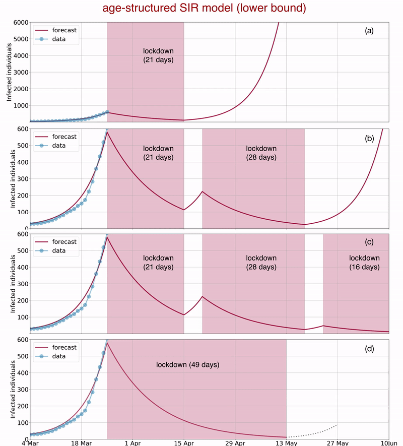

## PyRoss: Infectious disease models in Python [](https://mybinder.org/v2/gh/rajeshrinet/pyross/master?filepath=examples)

[About](#about) | [Contact](#contact) | [Publications ](#publications) | [News](#news) | [Installation](#installation) | [Examples](#examples) | [License](#license)


## About

[PyRoss](https://gitlab.com/rajeshrinet/pyross) is a numerical library for mathematical modelling of infectious disease in Python. Currently the library supports structured compartment models formulated as systems of differential equations. 

The library was developed to model the outbreak of the novel coronavirus COVID-19 and to assess the age-structured impact of social distancing measures in India. 

The library is named after [Sir Ronald Ross](https://en.wikipedia.org/wiki/Ronald_Ross), doctor, mathematician and poet. In 1898 he made "the great discovery" in his laboratory in Calcutta "that malaria is conveyed by the bite of a mosquito".  He won the Nobel Prize in 1902 and laid the foundations of the mathematical modelling of infectious diseases. 


## Contact

The authors are part of [The Rapid Assistance in Modelling the Pandemic (RAMP) ](https://www.maths.cam.ac.uk/features/call-action-covid-19) taskforce. We can be contacted at: rs2004@cam.ac.uk (Rajesh Singh) and ra413@cam.ac.uk (R. Adhikari). 

Please [open an issue](https://github.com/rajeshrinet/pyross/issues) in preference to emailing us with queries, as these can then be shared with others with similar queries. Thanks!


## Publications

* [Age-structured impact of social distancing on the COVID-19 epidemic in India](https://github.com/rajeshrinet/pyross/blob/master/draft/covid19.pdf), Rajesh Singh and R. Adhikari, [arXiv:2003.12055](https://arxiv.org/abs/2003.12055).

Our latest forecast using case data until 25-03-2020:



## News
News articles about our COVID-19 paper:  [Zee News](https://zeenews.india.com/india/3-week-coronavirus-covid-19-lockdown-not-enough-sustained-periods-of-shutdown-with-periodic-relaxation-will-work-research-2272313.html) | [The Whit Worth Gazette](https://thewhitworthgazette.com/2020/03/30/coronavirus-lockdown-cambridge-model-predicts-what-india-needs-to-contain-covid-19-spread) |  [The Weekend Leader](http://www.theweekendleader.com/Headlines/54963/49-day-lockdown-necessary-to-stop-covid-19-resurgence-in-india-study.html) | [The Weather Channel](https://weather.com/en-IN/india/coronavirus/news/2020-03-29-india-needs-49-day-lockdown-prevent-resurgence-covid-19-study) | [The Tribune](https://www.tribuneindia.com/news/49-day-lockdown-necessary-to-stop-coronavirus-resurgence-in-india-study-62790) | [The Times of India](https://timesofindia.indiatimes.com/readersblog/viewofac/a-hard-headed-look-can-india-fight-covid-19-only-through-lock-down-for-how-long-11163/) | [The Telegraph](https://www.telegraphindia.com/india/coronavirus-outbreak-a-case-for-evidence-based-lockdowns-after-april-14/cid/1760155) | [The Northlines](http://www.thenorthlines.com/21-day-covid-19-lockdown-not-enough-sustained-shutdown-with-periodic-relaxation-will-work-research/) | [The New Indian Express](https://www.newindianexpress.com/nation/2020/mar/28/21-day-lockdown-not-enough-to-contain-coronavirus-outbreak-study-2122803.html) |  [Swarajya](https://swarajyamag.com/insta/49-day-lockdown-required-to-prevent-return-of-covid-19-in-india-cambridge-university-study-suggests) | [Snoop Tales](https://snooptales.com/2020/03/30/coronavirus-lockdown-cambridge-model-predicts-what-india-needs-to-contain-covid-19-spread/) | [Scroll.in](https://scroll.in/article/957636/the-political-fix-heres-what-indias-chaotic-attempt-to-lock-down-1-3-billion-people-looks-like) | [People's Reporter](https://www.peoplesreporter.in/science-technology/5801-minimum-49-days-lockdown-necessary-to-prevent-covid-19-says-cambridge-researcher.html) | [News Bundle](https://newsbunddle.com/%E0%A4%95%E0%A5%8B%E0%A4%B0%E0%A5%8B%E0%A4%A8%E0%A4%BE%E0%A4%B5%E0%A4%BE%E0%A4%AF%E0%A4%B0%E0%A4%B8-%E0%A4%B2%E0%A5%89%E0%A4%95%E0%A4%A1%E0%A4%BE%E0%A4%89%E0%A4%A8-%E0%A4%95%E0%A5%88%E0%A4%AE/) | [Newsgram](https://www.newsgram.com/49-day-national-lockdown-prevent-coronavirus-resurgence-india) |  [Mathrubhumi](https://www.mathrubhumi.com/news/india/49-day-lockdown-necessary-to-stop-coronavirus-resurgence-in-india-study-1.4652600)  | [liveMint](https://www.livemint.com/news/india/49-day-lockdown-necessary-to-stop-coronavirus-resurgence-in-india-study-11585473979844.html) |  [India New England News](https://indianewengland.com/2020/03/49-day-lockdown-necessary-to-stop-covid-19-resurgence-in-india-study/) | [India Today](https://www.indiatoday.in/india/story/coronavirus-lockdown-india-cambridge-mathematical-model-extension-1661321-2020-03-30) | [Indian Express: Bangla](https://bengali.indianexpress.com/opinion/21-days-lock-down-not-enough-exponential-curve-research-206782/) | [Indian Blooms](https://indiablooms.com/health-details/H/5782/india-needs-49-day-lockdown-to-combat-covid-19-cambridge-study.html) | [Dainik Bhaskar](https://f87kg.app.goo.gl/epaper) | [CCN](https://www.ccn.com/indias-total-coronavirus-lockdown-isnt-enough-and-its-faltering/) | [Business Standard](https://www.business-standard.com/article/current-affairs/49-day-lockdown-necessary-to-stop-coronavirus-resurgence-in-india-study-120032900487_1.html) | [Asiaville](https://www.asiavillenews.com/article/experts-on-whether-india-will-flatten-covid-19-curve-effectively-37658)

## Installation
Clone (or download) the repository and use a terminal to install using 

```bash
>> git clone https://github.com/rajeshrinet/pyross.git
>> cd pyross
>> python setup.py install
```

PyRoss requires the following software 

- Python 2.6+ or Python 3.4+
- [Cython 0.25.x+](http://docs.cython.org/en/latest/index.html) |  [Matplotlib 2.0.x+](https://matplotlib.org) | [NumPy 1.x+](http://www.numpy.org) |  [Pandas](https://pandas.pydata.org/) | [SciPy 1.1.x+](https://www.scipy.org/) | [xlrd](https://xlrd.readthedocs.io/en/latest/)

## Data sources

The age and social contact data that is needed to construct structured compartment models can be found at the following sources:

**Age structure:** [Population Pyramid](https://www.populationpyramid.net/) website. 

**Contact structure:** *Projecting social contact matrices in 152 countries using contact surveys and demographic data*, Kiesha Prem, Alex R. Cook, Mark Jit, PLOS Computational Biology, (2017) [DOI]( https://doi.org/10.1371/journal.pcbi.1005697), [Supporting Information Text](https://doi.org/10.1371/journal.pcbi.1005697.s001)  and [Supporting Information Data](https://doi.org/10.1371/journal.pcbi.1005697.s001).

The list of COVID-19 cases is obtained from the [Worldometer website](https://www.worldometers.info/coronavirus).


## Examples
```Python
#Ex1: M=1, SIR
import numpy as np
import pyross
M = 1                  # the SIR model has no age structure
Ni = 1000*np.ones(M)   # so there is only one age group 
N = np.sum(Ni)         # and the total population is the size of this age group

beta  = 0.2            # infection rate 
gamma = 0.1            # recovery rate 
alpha = 0              # fraction of asymptomatic infectives 
fsa   = 1              # the self-isolation parameter 


Ia0 = np.array([0])     # the SIR model has only one kind of infective 
Is0 = np.array([1])     # we take these to be symptomatic 
R0  = np.array([0])     # and assume there are no recovered individuals initially 
S0  = N-(Ia0+Is0+R0)    # so that the initial susceptibles are obtained from S + Ia + Is + R = N

# there is no contact structure
def contactMatrix(t):   
    return np.identity(M) 

# duration of simulation and data file
Tf = 160;  Nt=160; filename = 'this.mat'

# instantiate model
parameters = {'alpha':alpha, 'beta':beta, 'gamma':gamma,'fsa':fsa}
model = pyross.models.SIR(parameters, M, Ni)

# simulate model
model.simulate(S0, Ia0, Is0, contactMatrix, Tf, Nt, filename)
```

* See the [examples folder](https://github.com/rajeshrinet/pyross/tree/master/examples) for a list of worked-out examples.

* [State-wise prediction of COVID-19 in India using PyRoss by Ashish Kumar and Mohit Chaukikar](https://medium.com/@mohit.chaukikar_57513/an-attempt-to-study-the-spread-of-covid-19-at-state-level-in-india-6ccb910c8b55)


## License
We believe that openness and sharing improves the practice of science and increases the reach of its benefits. This code is released under the [MIT license](http://opensource.org/licenses/MIT). Our choice is guided by the excellent article on [Licensing for the scientist-programmer](http://www.ploscompbiol.org/article/info%3Adoi%2F10.1371%2Fjournal.pcbi.1002598). 
