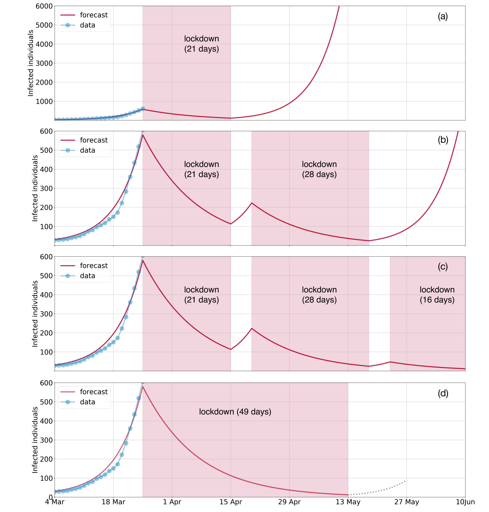

## PyRoss: Infectious disease models in Python [](https://mybinder.org/v2/gh/rajeshrinet/pyross/master?filepath=examples)

[About](#about) | [Contact](#contact) | [Publications ](#publications) | [News](#news) | [Installation](#installation) | [Examples](#examples) | [Support](#support) | [License](#license)


## Contact
The authors of the paper can be contact at: Rajesh Singh (rs2004@cam.ac.uk) and R. Adhikari (ra413@cam.ac.uk)

## About

[PyRoss](https://gitlab.com/rajeshrinet/pyross) is a numerical library for mathematical modelling of infectious disease in Python. Currently the library supports structured compartment models formulated as systems of differential equations. 

The library was developed to model the outbreak of the novel coronavirus COVID-19 and to assess the age-structured impact of social distancing measures in India. 

The library is named after [Sir Ronald Ross](https://en.wikipedia.org/wiki/Ronald_Ross), doctor, mathematician and poet. In 1898 he made "the great discovery" in his laboratory in Calcutta "that malaria is conveyed by the bite of a mosquito".  He won the Nobel Prize in 1902 and laid the foundations of the mathematical modelling of infectious diseases. 


## Publications

* [Age-structured impact of social distancing on the COVID-19 epidemic in India](https://github.com/rajeshrinet/pyross/blob/master/draft/covid19.pdf), Rajesh Singh and R. Adhikari, [arXiv:2003.12055](https://arxiv.org/abs/2003.12055).

Our latest forecast using case data until 25-03-2020:



## News
News articles about our COVID-19 paper:  [Zee News](https://zeenews.india.com/india/3-week-coronavirus-covid-19-lockdown-not-enough-sustained-periods-of-shutdown-with-periodic-relaxation-will-work-research-2272313.html) |  [The Weekend Leader](http://www.theweekendleader.com/Headlines/54963/49-day-lockdown-necessary-to-stop-covid-19-resurgence-in-india-study.html) | [The Tribune](https://www.tribuneindia.com/news/49-day-lockdown-necessary-to-stop-coronavirus-resurgence-in-india-study-62790) | [The Times of India](https://timesofindia.indiatimes.com/readersblog/viewofac/a-hard-headed-look-can-india-fight-covid-19-only-through-lock-down-for-how-long-11163/) | [The Telegraph](https://www.telegraphindia.com/india/coronavirus-outbreak-a-case-for-evidence-based-lockdowns-after-april-14/cid/1760155) | [The Northlines](http://www.thenorthlines.com/21-day-covid-19-lockdown-not-enough-sustained-shutdown-with-periodic-relaxation-will-work-research/) | [The New Indian Express](https://www.newindianexpress.com/nation/2020/mar/28/21-day-lockdown-not-enough-to-contain-coronavirus-outbreak-study-2122803.html) |  [Swarajya](https://swarajyamag.com/insta/49-day-lockdown-required-to-prevent-return-of-covid-19-in-india-cambridge-university-study-suggests) |[People's reported](https://www.peoplesreporter.in/science-technology/5801-minimum-49-days-lockdown-necessary-to-prevent-covid-19-says-cambridge-researcher.html) | [Newsgram](https://www.newsgram.com/49-day-national-lockdown-prevent-coronavirus-resurgence-india) |  [Mathrubhumi](https://www.mathrubhumi.com/news/india/49-day-lockdown-necessary-to-stop-coronavirus-resurgence-in-india-study-1.4652600)  | [liveMint](https://www.livemint.com/news/india/49-day-lockdown-necessary-to-stop-coronavirus-resurgence-in-india-study-11585473979844.html) |  [India New England News](https://indianewengland.com/2020/03/49-day-lockdown-necessary-to-stop-covid-19-resurgence-in-india-study/) | [Indian Express: Bangla](https://bengali.indianexpress.com/opinion/21-days-lock-down-not-enough-exponential-curve-research-206782/) | [Business Standard](https://www.business-standard.com/article/current-affairs/49-day-lockdown-necessary-to-stop-coronavirus-resurgence-in-india-study-120032900487_1.html)

## Installation
Clone (or download) the repository and use a terminal to install using 

```bash
>> git clone https://github.com/rajeshrinet/pyross.git
>> cd pyross
>> python setup.py install
```

PyRoss requires the following software 

- Python 2.6+ or Python 3.4+
- [Cython 0.25.x+](http://docs.cython.org/en/latest/index.html) |  [Matplotlib 2.0.x+](https://matplotlib.org) | [NumPy 1.x+](http://www.numpy.org) |  [Pandas](https://pandas.pydata.org/) | [SciPy 1.1.x+](https://www.scipy.org/) 

## Data sources

The age and social contact data that is needed to construct structured compartment models can be found at the following sources:

**Age structure:** [Population Pyramid](https://www.populationpyramid.net/) website. 

**Contact structure:** *Projecting social contact matrices in 152 countries using contact surveys and demographic data*, Kiesha Prem, Alex R. Cook, Mark Jit, PLOS Computational Biology, (2017) [DOI]( https://doi.org/10.1371/journal.pcbi.1005697), [Supporting Information Text](https://doi.org/10.1371/journal.pcbi.1005697.s001)  and [Supporting Information Data](https://doi.org/10.1371/journal.pcbi.1005697.s001).

The list of COVID-19 cases is obtained from the [Worldometer website](https://www.worldometers.info/coronavirus).


## Examples
```Python
#Ex1: M=1
import numpy as np
import pyross

M = 1                  # age groups
Ni = 1000*np.ones(M)   # population in each group
N = np.sum(Ni)

Ia0, Is0, R0 = 0, 1, 0
S0 = N - Ia0 - R0 - Is0

alpha, beta, gamma, fsa = 0, 0.2, 1./10, 1

Tf = 160;   C = np.zeros((2*Tf, M*M))
Nf=160; filename='this.mat'

for i in range(2*Tf):
    C[i, :] = np.identity(M).reshape(M*M)

#run simulation and save data
model = pyross.models.SIR(S0, Ia0, Is0, alpha, beta, gamma, fsa, M, Ni, Tf)
model.simulate(C, Nf, filename)
```


## Support

* For help with and questions about PyRoss, please post to the [pyross-users](https://groups.google.com/forum/#!forum/pyross) group.
* For bug reports and feature requests, please use the [issue tracker](https://github.com/rajeshrinet/pyross/issues) on GitHub.

## License
We believe that openness and sharing improves the practice of science and increases the reach of its benefits. This code is released under the [MIT license](http://opensource.org/licenses/MIT). Our choice is guided by the excellent article on [Licensing for the scientist-programmer](http://www.ploscompbiol.org/article/info%3Adoi%2F10.1371%2Fjournal.pcbi.1002598). 
