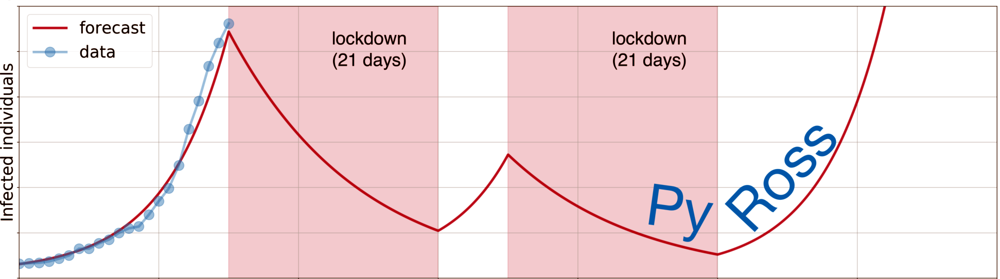

# PyRoss API

- [PyRoss API](#pyross-api)
- [pyross.deterministic](#pyrossdeterministic)
    - [class pyross.deterministic.IntegratorsClass()](#class-pyrossdeterministicintegratorsclass)
    - [simulateRHS : Performs numerical integration.()](#simulaterhs--performs-numerical-integration)
      - [simulateRHS()](#simulaterhs)
    - [class pyross.deterministic.SEAI5R()](#class-pyrossdeterministicseai5r)
      - [M()](#m)
      - [Ni()](#ni)
      - [simulate()](#simulate)
      - [S()](#s)
      - [E()](#e)
      - [A()](#a)
      - [Ia()](#ia)
      - [Is()](#is)
      - [Ih()](#ih)
      - [Ic()](#ic)
      - [Im()](#im)
      - [population()](#population)
      - [R()](#r)
      - [A()](#a-1)
      - [E()](#e-1)
      - [Ia()](#ia-1)
      - [Ic()](#ic-1)
      - [Ih()](#ih-1)
      - [Im()](#im-1)
      - [Is()](#is-1)
      - [R()](#r-1)
      - [S()](#s-1)
      - [population()](#population-1)
      - [simulate()](#simulate-1)
    - [class pyross.deterministic.SEAI8R()](#class-pyrossdeterministicseai8r)
      - [parameters()](#parameters)
      - [M()](#m-1)
      - [Ni()](#ni-1)
      - [simulate()](#simulate-2)
      - [S()](#s-2)
      - [E()](#e-2)
      - [Ia()](#ia-2)
      - [Is()](#is-2)
      - [Ih()](#ih-2)
      - [Ic()](#ic-2)
      - [Im()](#im-2)
      - [population()](#population-2)
      - [R()](#r-2)
      - [A()](#a-2)
      - [E()](#e-3)
      - [Ia()](#ia-3)
      - [Ic()](#ic-3)
      - [Ih()](#ih-3)
      - [Im()](#im-3)
      - [Is()](#is-3)
      - [R()](#r-3)
      - [S()](#s-3)
      - [population()](#population-3)
      - [simulate()](#simulate-3)
    - [class pyross.deterministic.SEAIR()](#class-pyrossdeterministicseair)
      - [M()](#m-2)
      - [Ni()](#ni-2)
      - [simulate()](#simulate-4)
      - [S()](#s-4)
      - [E()](#e-4)
      - [A()](#a-3)
      - [Ia()](#ia-4)
      - [Is()](#is-4)
      - [R()](#r-4)
      - [A()](#a-4)
      - [E()](#e-5)
      - [Ia()](#ia-5)
      - [Is()](#is-5)
      - [R()](#r-5)
      - [S()](#s-5)
      - [simulate()](#simulate-5)
    - [class pyross.deterministic.SEAIRQ()](#class-pyrossdeterministicseairq)
      - [parameters()](#parameters-1)
      - [M()](#m-3)
      - [Ni()](#ni-3)
      - [simulate()](#simulate-6)
      - [S()](#s-6)
      - [E()](#e-6)
      - [A()](#a-5)
      - [Ia()](#ia-6)
      - [Is()](#is-6)
      - [R()](#r-6)
      - [Q()](#q)
      - [A()](#a-6)
      - [E()](#e-7)
      - [Ia()](#ia-7)
      - [Is()](#is-7)
      - [Q()](#q-1)
      - [R()](#r-7)
      - [S()](#s-7)
      - [simulate()](#simulate-7)
    - [class pyross.deterministic.SEI5R()](#class-pyrossdeterministicsei5r)
      - [parameters()](#parameters-2)
      - [M()](#m-4)
      - [Ni()](#ni-4)
      - [simulate()](#simulate-8)
      - [S()](#s-8)
      - [E()](#e-8)
      - [Ia()](#ia-8)
      - [Is()](#is-8)
      - [Ih()](#ih-4)
      - [Ic()](#ic-4)
      - [Im()](#im-4)
      - [population()](#population-4)
      - [R()](#r-8)
      - [E()](#e-9)
      - [Ia()](#ia-9)
      - [Ic()](#ic-5)
      - [Ih()](#ih-5)
      - [Im()](#im-5)
      - [Is()](#is-9)
      - [R()](#r-9)
      - [S()](#s-9)
      - [population()](#population-5)
      - [simulate()](#simulate-9)
    - [class pyross.deterministic.SEI8R()](#class-pyrossdeterministicsei8r)
      - [parameters()](#parameters-3)
      - [M()](#m-5)
      - [Ni()](#ni-5)
      - [simulate()](#simulate-10)
      - [S()](#s-10)
      - [E()](#e-10)
      - [Ia()](#ia-10)
      - [Is()](#is-10)
      - [Ih()](#ih-6)
      - [Ic()](#ic-6)
      - [Im()](#im-6)
      - [population()](#population-6)
      - [R()](#r-10)
      - [E()](#e-11)
      - [Ia()](#ia-11)
      - [Ic()](#ic-7)
      - [Ih()](#ih-7)
      - [Im()](#im-7)
      - [Is()](#is-11)
      - [R()](#r-11)
      - [S()](#s-11)
      - [population()](#population-7)
      - [simulate()](#simulate-11)
    - [class pyross.deterministic.SEIR()](#class-pyrossdeterministicseir)
      - [M()](#m-6)
      - [Ni()](#ni-6)
      - [simulate()](#simulate-12)
      - [S()](#s-12)
      - [E()](#e-12)
      - [A()](#a-7)
      - [Ia()](#ia-12)
      - [Is()](#is-12)
      - [R()](#r-12)
      - [E()](#e-13)
      - [Ia()](#ia-13)
      - [Is()](#is-13)
      - [R()](#r-13)
      - [S()](#s-13)
      - [simulate()](#simulate-13)
    - [class pyross.deterministic.SEkIkIkR()](#class-pyrossdeterministicsekikikr)
      - [M()](#m-7)
      - [Ni()](#ni-7)
      - [simulate()](#simulate-14)
      - [E()](#e-14)
      - [Ia()](#ia-14)
      - [Is()](#is-14)
      - [R()](#r-14)
      - [S()](#s-14)
      - [simulate()](#simulate-15)
    - [class pyross.deterministic.SEkIkR()](#class-pyrossdeterministicsekikr)
      - [M()](#m-8)
      - [Ni()](#ni-8)
      - [simulate()](#simulate-16)
      - [E()](#e-15)
      - [I()](#i)
      - [R()](#r-15)
      - [S()](#s-15)
      - [simulate()](#simulate-17)
    - [class pyross.deterministic.SIR()](#class-pyrossdeterministicsir)
      - [parameters()](#parameters-4)
      - [M()](#m-9)
      - [Ni()](#ni-9)
      - [simulate()](#simulate-18)
      - [S()](#s-16)
      - [Ia()](#ia-15)
      - [Is()](#is-15)
      - [R()](#r-16)
      - [Ia()](#ia-16)
      - [Is()](#is-16)
      - [R()](#r-17)
      - [S()](#s-17)
      - [simulate()](#simulate-19)
    - [class pyross.deterministic.SIRS()](#class-pyrossdeterministicsirs)
      - [M()](#m-10)
      - [Ni()](#ni-10)
      - [simulate()](#simulate-20)
      - [S()](#s-18)
      - [Ia()](#ia-17)
      - [Is()](#is-17)
      - [population()](#population-8)
      - [R()](#r-18)
      - [Ia()](#ia-18)
      - [Is()](#is-18)
      - [R()](#r-19)
      - [S()](#s-19)
      - [population()](#population-9)
      - [simulate()](#simulate-21)
    - [class pyross.deterministic.SIkR()](#class-pyrossdeterministicsikr)
      - [M()](#m-11)
      - [Ni()](#ni-11)
      - [simulate()](#simulate-22)
      - [I()](#i-1)
      - [R()](#r-20)
      - [S()](#s-20)
      - [simulate()](#simulate-23)
    - [class pyross.deterministic.Spp()](#class-pyrossdeterministicspp)
      - [parameters()](#parameters-5)
      - [M()](#m-12)
      - [Ni()](#ni-12)
      - [simulate()](#simulate-24)
      - [S()](#s-21)
      - [model_class_data()](#model_class_data)
      - [simulate()](#simulate-25)
- [pyross.stochastic](#pyrossstochastic)
    - [class pyross.stochastic.SEAI5R()](#class-pyrossstochasticseai5r)
      - [M()](#m-13)
      - [Ni()](#ni-13)
    - [rate_matrix:()](#rate_matrix)
    - [simulate:()](#simulate-26)
      - [A()](#a-8)
      - [E()](#e-16)
      - [Ia()](#ia-19)
      - [Ic()](#ic-8)
      - [Ih()](#ih-8)
      - [Im()](#im-8)
      - [Is()](#is-19)
      - [R()](#r-21)
      - [S()](#s-22)
      - [population()](#population-10)
    - [class pyross.stochastic.SEAIRQ()](#class-pyrossstochasticseairq)
      - [parameters()](#parameters-6)
      - [M()](#m-14)
      - [Ni()](#ni-14)
    - [rate_matrix:()](#rate_matrix-1)
    - [simulate:()](#simulate-27)
      - [A()](#a-9)
      - [E()](#e-17)
      - [Ia()](#ia-20)
      - [Is()](#is-20)
      - [Q()](#q-2)
      - [R()](#r-22)
      - [S()](#s-23)
    - [class pyross.stochastic.SEI5R()](#class-pyrossstochasticsei5r)
      - [parameters()](#parameters-7)
    - [rate_matrix:()](#rate_matrix-2)
    - [simulate:()](#simulate-28)
      - [E()](#e-18)
      - [Ia()](#ia-21)
      - [Ic()](#ic-9)
      - [Ih()](#ih-9)
      - [Im()](#im-9)
      - [Is()](#is-21)
      - [R()](#r-23)
      - [S()](#s-24)
      - [population()](#population-11)
    - [class pyross.stochastic.SEIR()](#class-pyrossstochasticseir)
      - [M()](#m-15)
      - [Ni()](#ni-15)
    - [rate_matrix:()](#rate_matrix-3)
    - [simulate:()](#simulate-29)
      - [E()](#e-19)
      - [Ia()](#ia-22)
      - [Is()](#is-22)
      - [R()](#r-24)
      - [S()](#s-25)
    - [class pyross.stochastic.SIR()](#class-pyrossstochasticsir)
      - [parameters()](#parameters-8)
      - [M()](#m-16)
      - [Ni()](#ni-16)
    - [rate_matrix:()](#rate_matrix-4)
    - [simulate:()](#simulate-30)
      - [Ia()](#ia-23)
      - [Is()](#is-23)
      - [R()](#r-25)
      - [S()](#s-26)
      - [simulate()](#simulate-31)
    - [class pyross.stochastic.SIkR()](#class-pyrossstochasticsikr)
      - [M()](#m-17)
      - [Ni()](#ni-17)
    - [rate_matrix:()](#rate_matrix-5)
    - [simulate:()](#simulate-32)
      - [I()](#i-2)
      - [R()](#r-26)
      - [S()](#s-27)
    - [class pyross.stochastic.stochastic_integration()](#class-pyrossstochasticstochastic_integration)
      - [calculate_total_reaction_rate()](#calculate_total_reaction_rate)
    - [SSA_step:()](#ssa_step)
    - [simulate_gillespie:()](#simulate_gillespie)
      - [check_for_event()](#check_for_event)
      - [simulate_gillespie_events()](#simulate_gillespie_events)
      - [tau_leaping_update_timesteps()](#tau_leaping_update_timesteps)
      - [check_for_event()](#check_for_event-1)
      - [simulate_gillespie()](#simulate_gillespie-1)
      - [simulate_tau_leaping()](#simulate_tau_leaping)
- [pyross.hybrid](#pyrosshybrid)
    - [class pyross.hybrid.SIR()](#class-pyrosshybridsir)
      - [parameters()](#parameters-9)
      - [M()](#m-18)
      - [Ni()](#ni-18)
      - [simulate()](#simulate-33)
- [pyross.inference](#pyrossinference)
    - [class pyross.inference.SEAI5R()](#class-pyrossinferenceseai5r)
      - [M()](#m-19)
      - [steps()](#steps)
      - [dim()](#dim)
      - [fi()](#fi)
      - [alpha()](#alpha)
      - [beta()](#beta)
      - [gIa()](#gia)
      - [gIs()](#gis)
      - [fsa()](#fsa)
      - [gE()](#ge)
      - [gA()](#ga)
      - [gIh()](#gih)
      - [gIc()](#gic)
      - [hh()](#hh)
      - [cc()](#cc)
      - [mm()](#mm)
    - [All methods of the superclass SIR_type()](#all-methods-of-the-superclass-sir_type)
    - [make_det_model : returns deterministic model()](#make_det_model--returns-deterministic-model)
    - [make_params_dict : returns a dictionary of the input parameters()](#make_params_dict--returns-a-dictionary-of-the-input-parameters)
    - [integrate : returns numerical integration of the chosen model()](#integrate--returns-numerical-integration-of-the-chosen-model)
      - [integrate()](#integrate)
    - [class pyross.inference.SEAIRQ()](#class-pyrossinferenceseairq)
      - [N()](#n)
      - [M()](#m-20)
      - [steps()](#steps-1)
      - [dim()](#dim-1)
      - [fi()](#fi-1)
      - [alpha()](#alpha-1)
      - [beta()](#beta-1)
      - [gIa()](#gia-1)
      - [gIs()](#gis-1)
      - [gE()](#ge-1)
      - [gA()](#ga-1)
      - [fsa()](#fsa-1)
      - [tE()](#te)
      - [tA()](#ta)
      - [tIa()](#tia)
      - [tIs()](#tis)
    - [All methods of the superclass SIR_type()](#all-methods-of-the-superclass-sir_type-1)
    - [make_det_model : returns deterministic model()](#make_det_model--returns-deterministic-model-1)
    - [make_params_dict : returns a dictionary of the input parameters()](#make_params_dict--returns-a-dictionary-of-the-input-parameters-1)
    - [integrate : returns numerical integration of the chosen model()](#integrate--returns-numerical-integration-of-the-chosen-model-1)
      - [infer_control()](#infer_control)
      - [integrate()](#integrate-1)
      - [latent_infer_control()](#latent_infer_control)
    - [class pyross.inference.SEIR()](#class-pyrossinferenceseir)
      - [M()](#m-21)
      - [steps()](#steps-2)
      - [dim()](#dim-2)
      - [fi()](#fi-2)
      - [alpha()](#alpha-2)
      - [beta()](#beta-2)
      - [gIa()](#gia-2)
      - [gIs()](#gis-2)
      - [fsa()](#fsa-2)
      - [gE()](#ge-2)
    - [All methods of the superclass SIR_type()](#all-methods-of-the-superclass-sir_type-2)
    - [make_det_model : returns deterministic model()](#make_det_model--returns-deterministic-model-2)
    - [make_params_dict : returns a dictionary of the input parameters()](#make_params_dict--returns-a-dictionary-of-the-input-parameters-2)
    - [integrate : returns numerical integration of the chosen model()](#integrate--returns-numerical-integration-of-the-chosen-model-2)
      - [integrate()](#integrate-2)
    - [class pyross.inference.SIR()](#class-pyrossinferencesir)
      - [N()](#n-1)
      - [M()](#m-22)
      - [steps()](#steps-3)
      - [dim()](#dim-3)
      - [fi()](#fi-3)
      - [alpha()](#alpha-3)
      - [beta()](#beta-3)
      - [gIa()](#gia-3)
      - [gIs()](#gis-3)
      - [fsa()](#fsa-3)
    - [All methods of the superclass SIR_Type.()](#all-methods-of-the-superclass-sir_type-3)
    - [make_det_model : returns deterministic model.()](#make_det_model--returns-deterministic-model-3)
    - [make_params_dict : returns a dictionary of the input parameters.()](#make_params_dict--returns-a-dictionary-of-the-input-parameters-3)
    - [integrate : returns numerical integration of the chosen model.()](#integrate--returns-numerical-integration-of-the-chosen-model-3)
      - [integrate()](#integrate-3)
    - [class pyross.inference.SIR_type()](#class-pyrossinferencesir_type)
      - [compute_hessian()](#compute_hessian)
      - [compute_hessian_latent()](#compute_hessian_latent)
      - [hessian()](#hessian)
      - [hessian_latent()](#hessian_latent)
      - [infer_control()](#infer_control-1)
      - [infer_parameters()](#infer_parameters)
      - [inference()](#inference)
      - [integrate()](#integrate-4)
      - [latent_infer_control()](#latent_infer_control-1)
      - [latent_infer_parameters()](#latent_infer_parameters)
      - [latent_inference()](#latent_inference)
      - [minus_logp_red()](#minus_logp_red)
    - [class pyross.inference.Spp()](#class-pyrossinferencespp)
      - [integrate()](#integrate-5)
- [pyross.control](#pyrosscontrol)
    - [class pyross.control.SEAI5R()](#class-pyrosscontrolseai5r)
      - [M()](#m-23)
      - [Ni()](#ni-19)
      - [simulate()](#simulate-34)
    - [class pyross.control.SEAIR()](#class-pyrosscontrolseair)
      - [M()](#m-24)
      - [Ni()](#ni-20)
      - [simulate()](#simulate-35)
    - [class pyross.control.SEAIRQ()](#class-pyrosscontrolseairq)
      - [parameters()](#parameters-10)
      - [M()](#m-25)
      - [Ni()](#ni-21)
      - [simulate()](#simulate-36)
    - [class pyross.control.SEI5R()](#class-pyrosscontrolsei5r)
      - [parameters()](#parameters-11)
      - [M()](#m-26)
      - [Ni()](#ni-22)
      - [simulate()](#simulate-37)
    - [class pyross.control.SEIR()](#class-pyrosscontrolseir)
      - [M()](#m-27)
      - [Ni()](#ni-23)
      - [simulate()](#simulate-38)
    - [class pyross.control.SEkIkIkR()](#class-pyrosscontrolsekikikr)
      - [M()](#m-28)
      - [Ni()](#ni-24)
      - [simulate()](#simulate-39)
      - [E()](#e-20)
      - [Ia()](#ia-24)
      - [Is()](#is-24)
      - [R()](#r-27)
      - [S()](#s-28)
    - [class pyross.control.SEkIkR()](#class-pyrosscontrolsekikr)
      - [M()](#m-29)
      - [Ni()](#ni-25)
      - [simulate()](#simulate-40)
    - [class pyross.control.SIR()](#class-pyrosscontrolsir)
      - [parameters()](#parameters-12)
      - [M()](#m-30)
      - [Ni()](#ni-26)
      - [simulate()](#simulate-41)
    - [class pyross.control.SIRS()](#class-pyrosscontrolsirs)
      - [M()](#m-31)
      - [Ni()](#ni-27)
      - [simulate()](#simulate-42)
    - [class pyross.control.SIkR()](#class-pyrosscontrolsikr)
      - [M()](#m-32)
      - [Ni()](#ni-28)
      - [simulate()](#simulate-43)
    - [class pyross.control.control_integration()](#class-pyrosscontrolcontrol_integration)
    - [simulate_deteministic : Performs a deterministic simulation.()](#simulate_deteministic--performs-a-deterministic-simulation)
      - [simulate_deterministic()](#simulate_deterministic)
- [pyross.forecast](#pyrossforecast)
    - [class pyross.forecast.SEAI5R()](#class-pyrossforecastseai5r)
      - [M()](#m-33)
      - [Ni()](#ni-29)
      - [simulate()](#simulate-44)
      - [simulate()](#simulate-45)
    - [class pyross.forecast.SEAI5R_latent()](#class-pyrossforecastseai5r_latent)
      - [parameters()](#parameters-13)
      - [M()](#m-34)
      - [Ni()](#ni-30)
      - [simulate()](#simulate-46)
      - [simulate()](#simulate-47)
    - [class pyross.forecast.SEAIRQ()](#class-pyrossforecastseairq)
      - [M()](#m-35)
      - [Ni()](#ni-31)
      - [simulate()](#simulate-48)
      - [simulate()](#simulate-49)
    - [class pyross.forecast.SEAIRQ_latent()](#class-pyrossforecastseairq_latent)
      - [M()](#m-36)
      - [Ni()](#ni-32)
      - [simulate()](#simulate-50)
      - [simulate()](#simulate-51)
    - [class pyross.forecast.SEIR()](#class-pyrossforecastseir)
      - [M()](#m-37)
      - [Ni()](#ni-33)
      - [simulate()](#simulate-52)
      - [simulate()](#simulate-53)
    - [class pyross.forecast.SEIR_latent()](#class-pyrossforecastseir_latent)
      - [parameters()](#parameters-14)
      - [M()](#m-38)
      - [Ni()](#ni-34)
      - [simulate()](#simulate-54)
      - [simulate()](#simulate-55)
    - [class pyross.forecast.SIR()](#class-pyrossforecastsir)
      - [parameters()](#parameters-15)
      - [M()](#m-39)
      - [Ni()](#ni-35)
      - [simulate()](#simulate-56)
      - [simulate()](#simulate-57)
    - [class pyross.forecast.SIR_latent()](#class-pyrossforecastsir_latent)
      - [parameters()](#parameters-16)
      - [M()](#m-40)
      - [Ni()](#ni-36)
      - [simulate()](#simulate-58)
      - [simulate()](#simulate-59)
- [pyross.contactMatrix](#pyrosscontactmatrix)
    - [class pyross.contactMatrix.ContactMatrixFunction()](#class-pyrosscontactmatrixcontactmatrixfunction)
    - [constant_CM : returns, CH, CW, CS, CO()](#constant_cm--returns-ch-cw-cs-co)
    - [class pyross.contactMatrix.SIR()](#class-pyrosscontactmatrixsir)
    - [pyross.contactMatrix.characterise_transient()](#pyrosscontactmatrixcharacterise_transient)
- [pyross.utils](#pyrossutils)
    - [pyross.utils.set_destination()](#pyrossutilsset_destination)
- [Indices and tables](#indices-and-tables)

# pyross.deterministic

### class pyross.deterministic.IntegratorsClass()
List of all integrator used by various deterministic models listed below.

### simulateRHS : Performs numerical integration.()

#### simulateRHS()
Performs numerical integration

* **Parameters**

    
    * **rhs0** (*python function**(**x**,**t**)*) – Input function of current state and time x, t
    returns dx/dt

    * **x0** (*np.array*) – Initial state vector.

    * **Ti** (*float*) – Start time for integrator.

    * **Tf** (*float*) – End time for integrator.

    * **Nf** (*Int*) – Number of time points to evaluate at.

    * **integrator** (*string**, **optional*) – Selects which integration method to use. The default is ‘odeint’.

    * **maxNumSteps** (*int**, **optional*) – maximum number of steps the integrator is allowed to take
    to obtain a solution. The default is 100000.

    * **\*\*kwargs** (*optional kwargs to be passed to the IntegratorsClass*) – 

* **Raises**

    **Exception** – If integration fails.

* **Returns**

    
    * **X** (*np.array(len(t), len(x0))*) – Numerical integration solution.

    * **time_points** (*np.array*) – Corresponding times at which X is evaluated at.

### class pyross.deterministic.SEAI5R()
Susceptible, Exposed, Activates, Infected, Recovered (SEAIR)
The infected class has 5 groups:
\* Ia: asymptomatic
\* Is: symptomatic
\* Ih: hospitalized
\* Ic: ICU
\* Im: Mortality

S  —> E
E  —> Ia, Is
Ia —> R
Is —> Ih, R
Ih —> Ic, R
Ic —> Im, R
.. attribute:: parameters

> Contains the following keys:

>     alpha

>         fraction of infected who are asymptomatic.

>     beta

>         rate of spread of infection.

>     gIa

>         rate of removal from asymptomatic individuals.

>     gIs

>         rate of removal from symptomatic individuals.

>     fsa

>         fraction by which symptomatic individuals self isolate.

>     gE

>         rate of removal from exposeds individuals.

>     gA

>         rate of removal from activated individuals.

>     gIh

>         rate of hospitalisation of infected individuals.

>     gIc

>         rate hospitalised individuals are moved to intensive care.

>     sa

>         daily arrival of new susceptables.
>         sa is rate of additional/removal of population by birth etc

>     hh

>         fraction hospitalised from Is

>     cc

>         fraction sent to intensive care from hospitalised.

>     mm

>         mortality rate in intensive care

> * **type**

>     dict

#### M()
Number of compartments of individual for each class.
I.e len(contactMatrix)

* **Type**

    int

#### Ni()
Initial number in each compartment and class

* **Type**

    np.array(M, )

#### simulate()

#### S()

#### E()

#### A()

#### Ia()

#### Is()

#### Ih()

#### Ic()

#### Im()

#### population()

#### R()

#### A()

* **Parameters**

    **data** (*data files*) – 

* **Returns**

    **‘A’**

* **Return type**

    Activated population time series

#### E()

* **Parameters**

    **data** (*data files*) – 

* **Returns**

    **‘E’**

* **Return type**

    Exposed population time series

#### Ia()

* **Parameters**

    **data** (*data files*) – 

* **Returns**

    **‘Ia’**

* **Return type**

    Asymptomatics population time series

#### Ic()

* **Parameters**

    **data** (*data files*) – 

* **Returns**

    **‘Ic’**

* **Return type**

    ICU hospitalized population time series

#### Ih()

* **Parameters**

    **data** (*data files*) – 

* **Returns**

    **‘Ic’**

* **Return type**

    hospitalized population time series

#### Im()

* **Parameters**

    **data** (*data files*) – 

* **Returns**

    **‘Ic’**

* **Return type**

    mortality time series

#### Is()

* **Parameters**

    **data** (*data files*) – 

* **Returns**

    **‘Is’**

* **Return type**

    symptomatics population time series

#### R()

* **Parameters**

    **data** (*data files*) – 

* **Returns**

    
    * **‘R’** (*Recovered population time series*)

    * *R = N(t) - (S + E + A + Ia + Is + Ih + Ic)*

#### S()

* **Parameters**

    **data** (*data files*) – 

* **Returns**

    **‘S’**

* **Return type**

    Susceptible population time series

#### population()

* **Parameters**

    **data** (*data files*) – 

* **Returns**

    

* **Return type**

    population

#### simulate()

* **Parameters**

    
    * **S0** (*np.array*) – Initial number of susceptables.

    * **E0** (*np.array*) – Initial number of exposeds.

    * **A0** (*np.array*) – Initial number of activateds.

    * **Ia0** (*np.array*) – Initial number of asymptomatic infectives.

    * **Is0** (*np.array*) – Initial number of symptomatic infectives.

    * **Ih0** (*np.array*) – Initial number of hospitalized infectives.

    * **Ic0** (*np.array*) – Initial number of ICU infectives.

    * **Im0** (*np.array*) – Initial number of mortality.

    * **contactMatrix** (*python function**(**t**)*) – The social contact matrix C_{ij} denotes the
    average number of contacts made per day by an
    individual in class i with an individual in class j

    * **Tf** (*float*) – Final time of integrator

    * **Nf** (*Int*) – Number of time points to evaluate.

    * **Ti** (*float**, **optional*) – Start time of integrator. The default is 0.

    * **integrator** (*TYPE**, **optional*) – Integrator to use either from scipy.integrate or odespy.
    The default is ‘odeint’.

    * **seedRate** (*python function**, **optional*) – Seeding of infectives. The default is None.

    * **maxNumSteps** (*int**, **optional*) – maximum number of steps the integrator can take. The default is 100000.

    * **\*\*kwargs** (*kwargs for integrator*) – 

* **Returns**

    ‘X’: output path from integrator, ‘t’: time points evaluated at,
    ‘param’: input param to integrator.

* **Return type**

    dict

### class pyross.deterministic.SEAI8R()
Susceptible, Exposed, Infected, Recovered (SEIR)
The infected class has 5 groups:
\* Ia: asymptomatic
\* Is: symptomatic
\* Ih: hospitalized
\* Ic: ICU
\* Im: Mortality

S  —> E
E  —> A
A  —> Ia, Is
Ia —> R
Is —> Is’ -> Ih, R
Ih —> Ih’ -> Ic, R
Ic —> Ic’ -> Im, R

#### parameters()
Contains the following keys:

    alpha

        fraction of infected who are asymptomatic.

    beta

        rate of spread of infection.

    gE

        rate of removal from exposeds individuals.

    gIa

        rate of removal from asymptomatic individuals.

    gIs

        rate of removal from symptomatic individuals.

    gIsp: float

        rate of removal from symptomatic individuals towards buffer.

    gIh

        rate of recovery for hospitalised individuals.

    gIhp: float

        rate of removal from hospitalised individuals towards buffer.

    gIc

        rate of recovery for idividuals in intensive care.

    gIcp: float

        rate of removal from ICU individuals towards buffer.

    fsa

        fraction by which symptomatic individuals self isolate.

    fh

        fraction by which hospitalised individuals are isolated.

    sa

        daily arrival of new susceptables.
        sa is rate of additional/removal of population by birth etc

    hh

        fraction hospitalised from Is

    cc

        fraction sent to intensive care from hospitalised.

    mm

        mortality rate in intensive care

* **Type**

    dict

#### M()
Number of compartments of individual for each class.
I.e len(contactMatrix)

* **Type**

    int

#### Ni()
Initial number in each compartment and class

* **Type**

    np.array(M, )

#### simulate()

#### S()

#### E()

#### Ia()

#### Is()

#### Ih()

#### Ic()

#### Im()

#### population()

#### R()

#### A()

* **Parameters**

    **data** (*data files*) – 

* **Returns**

    **‘A’**

* **Return type**

    Activates population time series

#### E()

* **Parameters**

    **data** (*data files*) – 

* **Returns**

    **‘E’**

* **Return type**

    Exposed population time series

#### Ia()

* **Parameters**

    **data** (*data files*) – 

* **Returns**

    **‘Ia’**

* **Return type**

    Asymptomatics population time series

#### Ic()

* **Parameters**

    **data** (*data files*) – 

* **Returns**

    **‘Ic’**

* **Return type**

    ICU hospitalized population time series

#### Ih()

* **Parameters**

    **data** (*data files*) – 

* **Returns**

    **‘Ic’**

* **Return type**

    hospitalized population time series

#### Im()

* **Parameters**

    **data** (*data files*) – 

* **Returns**

    **‘Ic’**

* **Return type**

    mortality time series

#### Is()

* **Parameters**

    **data** (*data files*) – 

* **Returns**

    **‘Is’**

* **Return type**

    symptomatics population time series

#### R()

* **Parameters**

    **data** (*data files*) – 

* **Returns**

    
    * **‘R’** (*Recovered population time series*)

    * *R = N(t) - (S + E + A+ Ia + Is + Ih + Ic)*

#### S()

* **Parameters**

    **data** (*data files*) – 

* **Returns**

    **‘S’**

* **Return type**

    Susceptible population time series

#### population()

* **Parameters**

    **data** (*data files*) – 

* **Returns**

    

* **Return type**

    population

#### simulate()

* **Parameters**

    
    * **S0** (*np.array*) – Initial number of susceptables.

    * **E0** (*np.array*) – Initial number of exposeds.

    * **Ia0** (*np.array*) – Initial number of asymptomatic infectives.

    * **Is0** (*np.array*) – Initial number of symptomatic infectives.

    * **Ih0** (*np.array*) – Initial number of hospitalized infectives.

    * **Ic0** (*np.array*) – Initial number of ICU infectives.

    * **Im0** (*np.array*) – Initial number of mortality.

    * **contactMatrix** (*python function**(**t**)*) – The social contact matrix C_{ij} denotes the
    average number of contacts made per day by an
    individual in class i with an individual in class j

    * **Tf** (*float*) – Final time of integrator

    * **Nf** (*Int*) – Number of time points to evaluate.

    * **Ti** (*float**, **optional*) – Start time of integrator. The default is 0.

    * **integrator** (*TYPE**, **optional*) – Integrator to use either from scipy.integrate or odespy.
    The default is ‘odeint’.

    * **seedRate** (*python function**, **optional*) – Seeding of infectives. The default is None.

    * **maxNumSteps** (*int**, **optional*) – maximum number of steps the integrator can take. The default is 100000.

    * **\*\*kwargs** (*kwargs for integrator*) – 

* **Returns**

    ‘X’: output path from integrator, ‘t’: time points evaluated at,
    ‘param’: input param to integrator.

* **Return type**

    dict

### class pyross.deterministic.SEAIR()
Susceptible, Exposed, Asymptomatic and infected, Infected, Recovered (SEAIR)
Ia: asymptomatic
Is: symptomatic
A : Asymptomatic and infectious
.. attribute:: parameters

> Contains the following keys:

>     alpha

>         fraction of infected who are asymptomatic.

>     beta

>         rate of spread of infection.

>     gIa

>         rate of removal from asymptomatic individuals.

>     gIs

>         rate of removal from symptomatic individuals.

>     fsa

>         fraction by which symptomatic individuals self isolate.

>     gE

>         rate of removal from exposeds individuals.

>     gA

>         rate of removal from activated individuals.

> * **type**

>     dict

#### M()
Number of compartments of individual for each class.
I.e len(contactMatrix)

* **Type**

    int

#### Ni()
Initial number in each compartment and class

* **Type**

    np.array(M, )

#### simulate()

#### S()

#### E()

#### A()

#### Ia()

#### Is()

#### R()

#### A()

* **Parameters**

    **data** (*data files*) – 

* **Returns**

    **‘A’**

* **Return type**

    Activated population time series

#### E()

* **Parameters**

    **data** (*data files*) – 

* **Returns**

    **‘E’**

* **Return type**

    Exposed population time series

#### Ia()

* **Parameters**

    **data** (*data files*) – 

* **Returns**

    **‘Ia’**

* **Return type**

    Asymptomatics population time series

#### Is()

* **Parameters**

    **data** (*data files*) – 

* **Returns**

    **‘Is’**

* **Return type**

    symptomatics population time series

#### R()

* **Parameters**

    **data** (*data files*) – 

* **Returns**

    **‘R’**

* **Return type**

    Recovered population time series

#### S()

* **Parameters**

    **data** (*data files*) – 

* **Returns**

    **‘S’**

* **Return type**

    Susceptible population time series

#### simulate()

* **Parameters**

    
    * **S0** (*np.array*) – Initial number of susceptables.

    * **E0** (*np.array*) – Initial number of exposeds.

    * **A0** (*np.array*) – Initial number of activateds.

    * **Ia0** (*np.array*) – Initial number of asymptomatic infectives.

    * **Is0** (*np.array*) – Initial number of symptomatic infectives.

    * **contactMatrix** (*python function**(**t**)*) – The social contact matrix C_{ij} denotes the
    average number of contacts made per day by an
    individual in class i with an individual in class j

    * **Tf** (*float*) – Final time of integrator

    * **Nf** (*Int*) – Number of time points to evaluate.

    * **Ti** (*float**, **optional*) – Start time of integrator. The default is 0.

    * **integrator** (*TYPE**, **optional*) – Integrator to use either from scipy.integrate or odespy.
    The default is ‘odeint’.

    * **seedRate** (*python function**, **optional*) – Seeding of infectives. The default is None.

    * **maxNumSteps** (*int**, **optional*) – maximum number of steps the integrator can take. The default is 100000.

    * **\*\*kwargs** (*kwargs for integrator*) – 

* **Returns**

    ‘X’: output path from integrator, ‘t’: time points evaluated at,
    ‘param’: input param to integrator.

* **Return type**

    dict

### class pyross.deterministic.SEAIRQ()
Susceptible, Exposed, Asymptomatic and infected, Infected, Recovered, Quarantined (SEAIRQ)
Ia: asymptomatic
Is: symptomatic
A : Asymptomatic and infectious

#### parameters()
Contains the following keys:

    alpha

        fraction of infected who are asymptomatic.

    beta

        rate of spread of infection.

    gIa

        rate of removal from asymptomatic individuals.

    gIs

        rate of removal from symptomatic individuals.

    gE

        rate of removal from exposed individuals.

    gA

        rate of removal from activated individuals.

    fsa

        fraction by which symptomatic individuals self isolate.

    tE

        testing rate and contact tracing of exposeds

    tA

        testing rate and contact tracing of activateds

    tIa

        testing rate and contact tracing of asymptomatics

    tIs

        testing rate and contact tracing of symptomatics

* **Type**

    dict

#### M()
Number of compartments of individual for each class.
I.e len(contactMatrix)

* **Type**

    int

#### Ni()
Initial number in each compartment and class

* **Type**

    np.array(M, )

#### simulate()

#### S()

#### E()

#### A()

#### Ia()

#### Is()

#### R()

#### Q()

#### A()

* **Parameters**

    **data** (*data files*) – 

* **Returns**

    **‘A’**

* **Return type**

    Activated population time series

#### E()

* **Parameters**

    **data** (*data files*) – 

* **Returns**

    **‘E’**

* **Return type**

    Exposed population time series

#### Ia()

* **Parameters**

    **data** (*data files*) – 

* **Returns**

    **‘Ia’**

* **Return type**

    Asymptomatics population time series

#### Is()

* **Parameters**

    **data** (*data files*) – 

* **Returns**

    **‘Is’**

* **Return type**

    symptomatics population time series

#### Q()

* **Parameters**

    **data** (*data files*) – 

* **Returns**

    **‘Q’**

* **Return type**

    Quarantined population time series

#### R()

* **Parameters**

    **data** (*data files*) – 

* **Returns**

    **‘R’**

* **Return type**

    Recovered population time series

#### S()

* **Parameters**

    **data** (*data files*) – 

* **Returns**

    **‘S’**

* **Return type**

    Susceptible population time series

#### simulate()

* **Parameters**

    
    * **S0** (*np.array*) – Initial number of susceptables.

    * **E0** (*np.array*) – Initial number of exposeds.

    * **A0** (*np.array*) – Initial number of activateds.

    * **Ia0** (*np.array*) – Initial number of asymptomatic infectives.

    * **Is0** (*np.array*) – Initial number of symptomatic infectives.

    * **Q0** (*np.array*) – Initial number of quarantineds.

    * **contactMatrix** (*python function**(**t**)*) – The social contact matrix C_{ij} denotes the
    average number of contacts made per day by an
    individual in class i with an individual in class j

    * **Tf** (*float*) – Final time of integrator

    * **Nf** (*Int*) – Number of time points to evaluate.

    * **Ti** (*float**, **optional*) – Start time of integrator. The default is 0.

    * **integrator** (*TYPE**, **optional*) – Integrator to use either from scipy.integrate or odespy.
    The default is ‘odeint’.

    * **seedRate** (*python function**, **optional*) – Seeding of infectives. The default is None.

    * **maxNumSteps** (*int**, **optional*) – maximum number of steps the integrator can take. The default is 100000.

    * **\*\*kwargs** (*kwargs for integrator*) – 

* **Returns**

    ‘X’: output path from integrator, ‘t’: time points evaluated at,
    ‘param’: input param to integrator.

* **Return type**

    dict

### class pyross.deterministic.SEI5R()
Susceptible, Exposed, Infected, Recovered (SEIR)
The infected class has 5 groups:
\* Ia: asymptomatic
\* Is: symptomatic
\* Ih: hospitalized
\* Ic: ICU
\* Im: Mortality

S  —> E
E  —> Ia, Is
Ia —> R
Is —> Ih, R
Ih —> Ic, R
Ic —> Im, R

#### parameters()
Contains the following keys:

    alpha

        fraction of infected who are asymptomatic.

    beta

        rate of spread of infection.

    gE

        rate of removal from exposeds individuals.

    gIa

        rate of removal from asymptomatic individuals.

    gIs

        rate of removal from symptomatic individuals.

    gIh

        rate of recovery for hospitalised individuals.

    gIc

        rate of recovery for idividuals in intensive care.

    fsa

        fraction by which symptomatic individuals self isolate.

    fh

        fraction by which hospitalised individuals are isolated.

    sa

        daily arrival of new susceptables.
        sa is rate of additional/removal of population by birth etc

    hh

        fraction hospitalised from Is

    cc

        fraction sent to intensive care from hospitalised.

    mm

        mortality rate in intensive care

* **Type**

    dict

#### M()
Number of compartments of individual for each class.
I.e len(contactMatrix)

* **Type**

    int

#### Ni()
Initial number in each compartment and class

* **Type**

    np.array(M, )

#### simulate()

#### S()

#### E()

#### Ia()

#### Is()

#### Ih()

#### Ic()

#### Im()

#### population()

#### R()

#### E()

* **Parameters**

    **data** (*data files*) – 

* **Returns**

    **‘E’**

* **Return type**

    Exposed population time series

#### Ia()

* **Parameters**

    **data** (*data files*) – 

* **Returns**

    **‘Ia’**

* **Return type**

    Asymptomatics population time series

#### Ic()

* **Parameters**

    **data** (*data files*) – 

* **Returns**

    **‘Ic’**

* **Return type**

    ICU hospitalized population time series

#### Ih()

* **Parameters**

    **data** (*data files*) – 

* **Returns**

    **‘Ic’**

* **Return type**

    hospitalized population time series

#### Im()

* **Parameters**

    **data** (*data files*) – 

* **Returns**

    **‘Ic’**

* **Return type**

    mortality time series

#### Is()

* **Parameters**

    **data** (*data files*) – 

* **Returns**

    **‘Is’**

* **Return type**

    symptomatics population time series

#### R()

* **Parameters**

    **data** (*data files*) – 

* **Returns**

    
    * **‘R’** (*Recovered population time series*)

    * *R = N(t) - (S + E + Ia + Is + Ih + Ic)*

#### S()

* **Parameters**

    **data** (*data files*) – 

* **Returns**

    **‘S’**

* **Return type**

    Susceptible population time series

#### population()

* **Parameters**

    **data** (*data files*) – 

* **Returns**

    

* **Return type**

    population

#### simulate()

* **Parameters**

    
    * **S0** (*np.array*) – Initial number of susceptables.

    * **E0** (*np.array*) – Initial number of exposeds.

    * **Ia0** (*np.array*) – Initial number of asymptomatic infectives.

    * **Is0** (*np.array*) – Initial number of symptomatic infectives.

    * **Ih0** (*np.array*) – Initial number of hospitalized infectives.

    * **Ic0** (*np.array*) – Initial number of ICU infectives.

    * **Im0** (*np.array*) – Initial number of mortality.

    * **contactMatrix** (*python function**(**t**)*) – The social contact matrix C_{ij} denotes the
    average number of contacts made per day by an
    individual in class i with an individual in class j

    * **Tf** (*float*) – Final time of integrator

    * **Nf** (*Int*) – Number of time points to evaluate.

    * **Ti** (*float**, **optional*) – Start time of integrator. The default is 0.

    * **integrator** (*TYPE**, **optional*) – Integrator to use either from scipy.integrate or odespy.
    The default is ‘odeint’.

    * **seedRate** (*python function**, **optional*) – Seeding of infectives. The default is None.

    * **maxNumSteps** (*int**, **optional*) – maximum number of steps the integrator can take. The default is 100000.

    * **\*\*kwargs** (*kwargs for integrator*) – 

* **Returns**

    ‘X’: output path from integrator, ‘t’: time points evaluated at,
    ‘param’: input param to integrator.

* **Return type**

    dict

### class pyross.deterministic.SEI8R()
Susceptible, Exposed, Infected, Recovered (SEIR)
The infected class has 5 groups:
\* Ia: asymptomatic
\* Is: symptomatic
\* Ih: hospitalized
\* Ic: ICU
\* Im: Mortality

S  —> E
E  —> Ia, Is
Ia —> R
Is —> Is’ -> Ih, R
Ih —> Ih’ -> Ic, R
Ic —> Ic’ -> Im, R

#### parameters()
Contains the following keys:

    alpha

        fraction of infected who are asymptomatic.

    beta

        rate of spread of infection.

    gE

        rate of removal from exposeds individuals.

    gIa

        rate of removal from asymptomatic individuals.

    gIs

        rate of removal from symptomatic individuals.

    gIsp: float

        rate of removal from symptomatic individuals towards buffer.

    gIh

        rate of recovery for hospitalised individuals.

    gIhp: float

        rate of removal from hospitalised individuals towards buffer.

    gIc

        rate of recovery for idividuals in intensive care.

    gIcp: float

        rate of removal from ICU individuals towards buffer.

    fsa

        fraction by which symptomatic individuals self isolate.

    fh

        fraction by which hospitalised individuals are isolated.

    sa

        daily arrival of new susceptables.
        sa is rate of additional/removal of population by birth etc

    hh

        fraction hospitalised from Is

    cc

        fraction sent to intensive care from hospitalised.

    mm

        mortality rate in intensive care

* **Type**

    dict

#### M()
Number of compartments of individual for each class.
I.e len(contactMatrix)

* **Type**

    int

#### Ni()
Initial number in each compartment and class

* **Type**

    np.array(M, )

#### simulate()

#### S()

#### E()

#### Ia()

#### Is()

#### Ih()

#### Ic()

#### Im()

#### population()

#### R()

#### E()

* **Parameters**

    **data** (*data files*) – 

* **Returns**

    **‘E’**

* **Return type**

    Exposed population time series

#### Ia()

* **Parameters**

    **data** (*data files*) – 

* **Returns**

    **‘Ia’**

* **Return type**

    Asymptomatics population time series

#### Ic()

* **Parameters**

    **data** (*data files*) – 

* **Returns**

    **‘Ic’**

* **Return type**

    ICU hospitalized population time series

#### Ih()

* **Parameters**

    **data** (*data files*) – 

* **Returns**

    **‘Ic’**

* **Return type**

    hospitalized population time series

#### Im()

* **Parameters**

    **data** (*data files*) – 

* **Returns**

    **‘Ic’**

* **Return type**

    mortality time series

#### Is()

* **Parameters**

    **data** (*data files*) – 

* **Returns**

    **‘Is’**

* **Return type**

    symptomatics population time series

#### R()

* **Parameters**

    **data** (*data files*) – 

* **Returns**

    
    * **‘R’** (*Recovered population time series*)

    * *R = N(t) - (S + E + Ia + Is + Ih + Ic)*

#### S()

* **Parameters**

    **data** (*data files*) – 

* **Returns**

    **‘S’**

* **Return type**

    Susceptible population time series

#### population()

* **Parameters**

    **data** (*data files*) – 

* **Returns**

    

* **Return type**

    population

#### simulate()

* **Parameters**

    
    * **S0** (*np.array*) – Initial number of susceptables.

    * **E0** (*np.array*) – Initial number of exposeds.

    * **Ia0** (*np.array*) – Initial number of asymptomatic infectives.

    * **Is0** (*np.array*) – Initial number of symptomatic infectives.

    * **Ih0** (*np.array*) – Initial number of hospitalized infectives.

    * **Ic0** (*np.array*) – Initial number of ICU infectives.

    * **Im0** (*np.array*) – Initial number of mortality.

    * **contactMatrix** (*python function**(**t**)*) – The social contact matrix C_{ij} denotes the
    average number of contacts made per day by an
    individual in class i with an individual in class j

    * **Tf** (*float*) – Final time of integrator

    * **Nf** (*Int*) – Number of time points to evaluate.

    * **Ti** (*float**, **optional*) – Start time of integrator. The default is 0.

    * **integrator** (*TYPE**, **optional*) – Integrator to use either from scipy.integrate or odespy.
    The default is ‘odeint’.

    * **seedRate** (*python function**, **optional*) – Seeding of infectives. The default is None.

    * **maxNumSteps** (*int**, **optional*) – maximum number of steps the integrator can take. The default is 100000.

    * **\*\*kwargs** (*kwargs for integrator*) – 

* **Returns**

    ‘X’: output path from integrator, ‘t’: time points evaluated at,
    ‘param’: input param to integrator.

* **Return type**

    dict

### class pyross.deterministic.SEIR()
Susceptible, Exposed, Infected, Recovered (SEIR)
Ia: asymptomatic
Is: symptomatic
.. attribute:: parameters

> Contains the following keys:

>     alpha

>         fraction of infected who are asymptomatic.

>     beta

>         rate of spread of infection.

>     gIa

>         rate of removal from asymptomatic individuals.

>     gIs

>         rate of removal from symptomatic individuals.

>     fsa

>         fraction by which symptomatic individuals self isolate.

>     gE

>         rate of removal from exposed individuals.

> * **type**

>     dict

#### M()
Number of compartments of individual for each class.
I.e len(contactMatrix)

* **Type**

    int

#### Ni()
Initial number in each compartment and class

* **Type**

    np.array(M, )

#### simulate()

#### S()

#### E()

#### A()

#### Ia()

#### Is()

#### R()

#### E()

* **Parameters**

    **data** (*data files*) – 

* **Returns**

    **‘E’**

* **Return type**

    Exposed population time series

#### Ia()

* **Parameters**

    **data** (*data files*) – 

* **Returns**

    **‘Ia’**

* **Return type**

    Asymptomatics population time series

#### Is()

* **Parameters**

    **data** (*data files*) – 

* **Returns**

    **‘Is’**

* **Return type**

    symptomatics population time series

#### R()

* **Parameters**

    **data** (*data files*) – 

* **Returns**

    **‘R’**

* **Return type**

    Recovered population time series

#### S()

* **Parameters**

    **data** (*data files*) – 

* **Returns**

    **‘S’**

* **Return type**

    Susceptible population time series

#### simulate()

* **Parameters**

    
    * **S0** (*np.array*) – Initial number of susceptables.

    * **E0** (*np.array*) – Initial number of exposed.

    * **Ia0** (*np.array*) – Initial number of asymptomatic infectives.

    * **Is0** (*np.array*) – Initial number of symptomatic infectives.

    * **contactMatrix** (*python function**(**t**)*) – The social contact matrix C_{ij} denotes the
    average number of contacts made per day by an
    individual in class i with an individual in class j

    * **Tf** (*float*) – Final time of integrator

    * **Nf** (*Int*) – Number of time points to evaluate.

    * **Ti** (*float**, **optional*) – Start time of integrator. The default is 0.

    * **integrator** (*TYPE**, **optional*) – Integrator to use either from scipy.integrate or odespy.
    The default is ‘odeint’.

    * **seedRate** (*python function**, **optional*) – Seeding of infectives. The default is None.

    * **maxNumSteps** (*int**, **optional*) – maximum number of steps the integrator can take. The default is 100000.

    * **\*\*kwargs** (*kwargs for integrator*) – 

* **Returns**

    ‘X’: output path from integrator, ‘t’: time points evaluated at,
    ‘param’: input param to integrator.

* **Return type**

    dict

### class pyross.deterministic.SEkIkIkR()
Susceptible, Exposed, Infected, Recovered (SEIR)
method of k-stages of Ia, Is, E
See: Lloyd, Theoretical Population Biology 60, 59􏰈71 (2001), doi:10.1006􏰅tpbi.2001.1525.
.. attribute:: parameters

> Contains the following keys:

>     alpha

>         fraction of infected who are asymptomatic.

>     beta

>         rate of spread of infection.

>     gIa: float

>         rate of removal from asymptomatic infected individuals.

>     gIs: float

>         rate of removal from symptomatic infected individuals.

>     gE

>         rate of removal from exposed individuals.

>     kI: int

>         number of stages of asymptomatic infectives.

>     kI: int

>         number of stages of symptomatic infectives.

>     kE

>         number of stages of exposed.

> * **type**

>     dict

#### M()
Number of compartments of individual for each class.
I.e len(contactMatrix)

* **Type**

    int

#### Ni()
Initial number in each compartment and class

* **Type**

    np.array(M, )

#### simulate()

#### E()

* **Parameters**

    **data** (*data files*) – 

* **Returns**

    **‘E’**

* **Return type**

    Exposed population time series

#### Ia()

* **Parameters**

    **data** (*data files*) – 

* **Returns**

    **‘Is’**

* **Return type**

    symptomatics population time series

#### Is()

* **Parameters**

    **data** (*data files*) – 

* **Returns**

    **‘Is’**

* **Return type**

    symptomatics population time series

#### R()

* **Parameters**

    **data** (*data files*) – 

* **Returns**

    **‘R’**

* **Return type**

    Recovered population time series

#### S()

* **Parameters**

    **data** (*data files*) – 

* **Returns**

    **‘S’**

* **Return type**

    Susceptible population time series

#### simulate()

* **Parameters**

    
    * **S0** (*np.array*) – Initial number of susceptables.

    * **E0** (*np.array*) – Initial number of exposeds.

    * **Ia0** (*np.array*) – Initial number of asymptomatic infectives.

    * **Is0** (*np.array*) – Initial number of symptomatic infectives.

    * **contactMatrix** (*python function**(**t**)*) – The social contact matrix C_{ij} denotes the
    average number of contacts made per day by an
    individual in class i with an individual in class j

    * **Tf** (*float*) – Final time of integrator

    * **Nf** (*Int*) – Number of time points to evaluate.

    * **Ti** (*float**, **optional*) – Start time of integrator. The default is 0.

    * **integrator** (*TYPE**, **optional*) – Integrator to use either from scipy.integrate or odespy.
    The default is ‘odeint’.

    * **maxNumSteps** (*int**, **optional*) – maximum number of steps the integrator can take. The default is 100000.

    * **\*\*kwargs** (*kwargs for integrator*) – 

* **Returns**

    ‘X’: output path from integrator, ‘t’: time points evaluated at,
    ‘param’: input param to integrator.

* **Return type**

    dict

### class pyross.deterministic.SEkIkR()
Susceptible, Exposed, Infected, Recovered (SEIR)
method of k-stages of I and E
See: Lloyd, Theoretical Population Biology 60, 59􏰈71 (2001), doi:10.1006􏰅tpbi.2001.1525.
.. attribute:: parameters

> Contains the following keys:

>     beta

>         rate of spread of infection.

>     gI

>         rate of removal from infected individuals.

>     gE

>         rate of removal from exposed individuals.

>     kI

>         number of stages of infectives.

>     kE

>         number of stages of exposed.

> * **type**

>     dict

#### M()
Number of compartments of individual for each class.
I.e len(contactMatrix)

* **Type**

    int

#### Ni()
Initial number in each compartment and class

* **Type**

    np.array(M, )

#### simulate()

#### E()

* **Parameters**

    **data** (*data files*) – 

* **Returns**

    **‘E’**

* **Return type**

    Exposed population time series

#### I()

* **Parameters**

    **data** (*data files*) – 

* **Returns**

    **‘Is’**

* **Return type**

    symptomatics population time series

#### R()

* **Parameters**

    **data** (*data files*) – 

* **Returns**

    **‘R’**

* **Return type**

    Recovered population time series

#### S()

* **Parameters**

    **data** (*data files*) – 

* **Returns**

    **‘S’**

* **Return type**

    Susceptible population time series

#### simulate()

* **Parameters**

    
    * **S0** (*np.array*) – Initial number of susceptables.

    * **E0** (*np.array*) – Initial number of exposeds.

    * **I0** (*np.array*) – Initial number of  infectives.

    * **contactMatrix** (*python function**(**t**)*) – The social contact matrix C_{ij} denotes the
    average number of contacts made per day by an
    individual in class i with an individual in class j

    * **Tf** (*float*) – Final time of integrator

    * **Nf** (*Int*) – Number of time points to evaluate.

    * **Ti** (*float**, **optional*) – Start time of integrator. The default is 0.

    * **integrator** (*TYPE**, **optional*) – Integrator to use either from scipy.integrate or odespy.
    The default is ‘odeint’.

    * **seedRate** (*python function**, **optional*) – Seeding of infectives. The default is None.

    * **maxNumSteps** (*int**, **optional*) – maximum number of steps the integrator can take. The default is 100000.

    * **\*\*kwargs** (*kwargs for integrator*) – 

* **Returns**

    ‘X’: output path from integrator, ‘t’: time points evaluated at,
    ‘param’: input param to integrator.

* **Return type**

    dict

### class pyross.deterministic.SIR()
Susceptible, Infected, Recovered (SIR)
Ia: asymptomatic
Is: symptomatic

…

#### parameters()
Contains the following keys:

    alpha

        fraction of infected who are asymptomatic.

    beta

        rate of spread of infection.

    gIa

        rate of removal from asymptomatic individuals.

    gIs

        rate of removal from symptomatic individuals.

    fsa

        fraction by which symptomatic individuals self isolate.

* **Type**

    dict

#### M()
Number of compartments of individual for each class.
I.e len(contactMatrix)

* **Type**

    int

#### Ni()
Initial number in each compartment and class

* **Type**

    np.array(M, )

#### simulate()

#### S()

#### Ia()

#### Is()

#### R()

#### Ia()

* **Parameters**

    **data** (*data files*) – 

* **Returns**

    **‘Ia’**

* **Return type**

    Asymptomatics population time series

#### Is()

* **Parameters**

    **data** (*data files*) – 

* **Returns**

    **‘Is’**

* **Return type**

    symptomatics population time series

#### R()

* **Parameters**

    **data** (*data files*) – 

* **Returns**

    **‘R’**

* **Return type**

    Recovered population time series

#### S()

* **Parameters**

    **data** (*data files*) – 

* **Returns**

    **‘S’**

* **Return type**

    Susceptible population time series

#### simulate()

* **Parameters**

    
    * **S0** (*np.array*) – Initial number of susceptables.

    * **Ia0** (*np.array*) – Initial number of asymptomatic infectives.

    * **Is0** (*np.array*) – Initial number of symptomatic infectives.

    * **contactMatrix** (*python function**(**t**)*) – The social contact matrix C_{ij} denotes the
    average number of contacts made per day by an
    individual in class i with an individual in class j

    * **Tf** (*float*) – Final time of integrator

    * **Nf** (*Int*) – Number of time points to evaluate.

    * **Ti** (*float**, **optional*) – Start time of integrator. The default is 0.

    * **integrator** (*TYPE**, **optional*) – Integrator to use either from scipy.integrate or odespy.
    The default is ‘odeint’.

    * **seedRate** (*python function**, **optional*) – Seeding of infectives. The default is None.

    * **maxNumSteps** (*int**, **optional** (**DEPRICATED**)*) – maximum number of steps the integrator can take. The default is 100000.

    * **\*\*kwargs** (*kwargs for integrator*) – 

* **Returns**

    ‘X’: output path from integrator, ‘t’: time points evaluated at,
    ‘param’: input param to integrator.

* **Return type**

    dict

### class pyross.deterministic.SIRS()
Susceptible, Infected, Recovered, Susceptible (SIRS)
Ia: asymptomatic
Is: symptomatic
.. attribute:: parameters

> Contains the following keys:

>     alpha

>         fraction of infected who are asymptomatic.

>     beta

>         rate of spread of infection.

>     gIa

>         rate of removal from asymptomatic individuals.

>     gIs

>         rate of removal from symptomatic individuals.

>     fsa

>         fraction by which symptomatic individuals self isolate.

>     ep

>         fraction of recovered who become susceptable again

>     sa

>         daily arrival of new susceptables

>     iaa

>         daily arrival of new asymptomatics

> * **type**

>     dict

#### M()
Number of compartments of individual for each class.
I.e len(contactMatrix)

* **Type**

    int

#### Ni()
Initial number in each compartment and class

* **Type**

    np.array(M, )

#### simulate()

#### S()

#### Ia()

#### Is()

#### population()

#### R()

#### Ia()

* **Parameters**

    **data** (*data files*) – 

* **Returns**

    **‘Ia’**

* **Return type**

    Asymptomatics population time series

#### Is()

* **Parameters**

    **data** (*data files*) – 

* **Returns**

    **‘Is’**

* **Return type**

    symptomatics population time series

#### R()

* **Parameters**

    **data** (*data files*) – 

* **Returns**

    **‘R’**

* **Return type**

    Recovered population time series

#### S()

* **Parameters**

    **data** (*data files*) – 

* **Returns**

    **‘S’**

* **Return type**

    Susceptible population time series

#### population()

* **Parameters**

    **data** (*data files*) – 

* **Returns**

    

* **Return type**

    population

#### simulate()

* **Parameters**

    
    * **S0** (*np.array*) – Initial number of susceptables.

    * **Ia0** (*np.array*) – Initial number of asymptomatic infectives.

    * **Is0** (*np.array*) – Initial number of symptomatic infectives.

    * **contactMatrix** (*python function**(**t**)*) – The social contact matrix C_{ij} denotes the
    average number of contacts made per day by an
    individual in class i with an individual in class j

    * **Tf** (*float*) – Final time of integrator

    * **Nf** (*Int*) – Number of time points to evaluate.

    * **Ti** (*float**, **optional*) – Start time of integrator. The default is 0.

    * **integrator** (*str**, **optional*) – Integrator to use either from scipy.integrate or odespy.
    The default is ‘odeint’.

    * **seedRate** (*python function**, **optional*) – Seeding of infectives. The default is None.

    * **maxNumSteps** (*int**, **optional*) – maximum number of steps the integrator can take. The default is 100000.

    * **\*\*kwargs** (*kwargs for integrator*) – 

* **Returns**

    ‘X’: output path from integrator, ‘t’: time points evaluated at,
    ‘param’: input param to integrator.

* **Return type**

    dict

### class pyross.deterministic.SIkR()
Susceptible, Infected, Recovered (SIkR)
method of k-stages of I
.. attribute:: parameters

> Contains the following keys:

>     beta

>         rate of spread of infection.

>     gI

>         rate of removal from infectives.

>     kI

>         number of stages of infection.

> * **type**

>     dict

#### M()
Number of compartments of individual for each class.
I.e len(contactMatrix)

* **Type**

    int

#### Ni()
Initial number in each compartment and class

* **Type**

    np.array(M, )

#### simulate()

#### I()

* **Parameters**

    **data** (*data files*) – 

* **Returns**

    **‘E’**

* **Return type**

    Exposed population time series

#### R()

* **Parameters**

    **data** (*data files*) – 

* **Returns**

    **‘R’**

* **Return type**

    Recovered population time series

#### S()

* **Parameters**

    **data** (*data files*) – 

* **Returns**

    **‘S’**

* **Return type**

    Susceptible population time series

#### simulate()

* **Parameters**

    
    * **S0** (*np.array*) – Initial number of susceptables.

    * **I0** (*np.array*) – Initial number of  infectives.

    * **contactMatrix** (*python function**(**t**)*) – The social contact matrix C_{ij} denotes the
    average number of contacts made per day by an
    individual in class i with an individual in class j

    * **Tf** (*float*) – Final time of integrator

    * **Nf** (*Int*) – Number of time points to evaluate.

    * **Ti** (*float**, **optional*) – Start time of integrator. The default is 0.

    * **integrator** (*TYPE**, **optional*) – Integrator to use either from scipy.integrate or odespy.
    The default is ‘odeint’.

    * **seedRate** (*python function**, **optional*) – Seeding of infectives. The default is None.

    * **maxNumSteps** (*int**, **optional*) – maximum number of steps the integrator can take. The default is 100000.

    * **\*\*kwargs** (*kwargs for integrator*) – 

* **Returns**

    ‘X’: output path from integrator, ‘t’: time points evaluated at,
    ‘param’: input param to integrator.

* **Return type**

    dict

### class pyross.deterministic.Spp()
Given a model specification, the

#### parameters()
Contains the values for the parameters given in the model specification.

* **Type**

    dict

#### M()
Number of compartments of individual for each class.
I.e len(contactMatrix)

* **Type**

    int

#### Ni()
Initial number in each compartment and class

* **Type**

    np.array(M, )

#### simulate()

#### S()

#### model_class_data()

* **Parameters**

    **data** (*data files*) – 

* **Returns**

    

* **Return type**

    The population of class model_class_key as a time series

#### simulate()

* **Parameters**

    
    * **x0** (*np.array** or **dict*) – Initial conditions. If it is an array it should have length
    M\*(model_dimension-1), where x0[i + j\*M] should be the initial
    value of model class i of age group j. The recovered R class
    must be left out. If it is a dict then
    it should have a key corresponding to each model class,
    with a 1D array containing the initial condition for each
    age group as value. One of the classes may be left out,
    in which case its initial values will be inferred from the
    others.

    * **contactMatrix** (*python function**(**t**)*) – The social contact matrix C_{ij} denotes the
    average number of contacts made per day by an
    individual in class i with an individual in class j

    * **Tf** (*float*) – Final time of integrator

    * **Nf** (*Int*) – Number of time points to evaluate.

    * **Ti** (*float**, **optional*) – Start time of integrator. The default is 0.

    * **integrator** (*TYPE**, **optional*) – Integrator to use either from scipy.integrate or odespy.
    The default is ‘odeint’.

    * **maxNumSteps** (*int**, **optional*) – maximum number of steps the integrator can take. The default is 100000.

    * **\*\*kwargs** (*kwargs for integrator*) – 

* **Returns**

    ‘X’: output path from integrator, ‘t’: time points evaluated at,
    ‘param’: input param to integrator.

* **Return type**

    dict

# pyross.stochastic

### class pyross.stochastic.SEAI5R()
Susceptible, Exposed, Activates, Infected, Recovered (SEAIR)
The infected class has 5 groups:
\* Ia: asymptomatic
\* Is: symptomatic
\* Ih: hospitalized
\* Ic: ICU
\* Im: Mortality

S  —> E
E  —> Ia, Is
Ia —> R
Is —> Ih, R
Ih —> Ic, R
Ic —> Im, R
.. attribute:: parameters

> Contains the following keys:

>     alpha

>         fraction of infected who are asymptomatic.

>     beta

>         rate of spread of infection.

>     gIa

>         rate of removal from asymptomatic individuals.

>     gIs

>         rate of removal from symptomatic individuals.

>     fsa

>         fraction by which symptomatic individuals self isolate.

>     gE

>         rate of removal from exposeds individuals.

>     gA

>         rate of removal from activated individuals.

>     gIh

>         rate of hospitalisation of infected individuals.

>     gIc

>         rate hospitalised individuals are moved to intensive care.

> * **type**

>     dict

#### M()
Number of compartments of individual for each class.
I.e len(contactMatrix)

* **Type**

    int

#### Ni()
Initial number in each compartment and class.

* **Type**

    np.array(9\*M, )

### rate_matrix:()
Calculates the rate constant for each reaction channel.

### simulate:()
Performs stochastic numerical integration.

#### A()

* **Parameters**

    **data** (*data files*) – 

* **Returns**

    **‘A’**

* **Return type**

    Activated population time series

#### E()

* **Parameters**

    **data** (*data files*) – 

* **Returns**

    **‘E’**

* **Return type**

    Exposed population time series

#### Ia()

* **Parameters**

    **data** (*data files*) – 

* **Returns**

    **‘Ia’**

* **Return type**

    Asymptomatics population time series

#### Ic()

* **Parameters**

    **data** (*data files*) – 

* **Returns**

    **‘Ic’**

* **Return type**

    ICU hospitalized population time series

#### Ih()

* **Parameters**

    **data** (*data files*) – 

* **Returns**

    **‘Ic’**

* **Return type**

    hospitalized population time series

#### Im()

* **Parameters**

    **data** (*data files*) – 

* **Returns**

    **‘Ic’**

* **Return type**

    mortality time series

#### Is()

* **Parameters**

    **data** (*data files*) – 

* **Returns**

    **‘Is’**

* **Return type**

    symptomatics population time series

#### R()

* **Parameters**

    **data** (*data files*) – 

* **Returns**

    
    * **‘R’** (*Recovered population time series*)

    * *R = N(t) - (S + E + A + Ia + Is + Ih + Ic)*

#### S()

* **Parameters**

    **data** (*data files*) – 

* **Returns**

    **‘S’**

* **Return type**

    Susceptible population time series

#### population()

* **Parameters**

    **data** (*data files*) – 

* **Returns**

    

* **Return type**

    population

### class pyross.stochastic.SEAIRQ()
Susceptible, Exposed, Asymptomatic and infected, Infected, Recovered, Quarantined (SEAIRQ)
Ia: asymptomatic
Is: symptomatic
A : Asymptomatic and infectious

#### parameters()
Contains the following keys:

    alpha

        fraction of infected who are asymptomatic.

    beta

        rate of spread of infection.

    gIa

        rate of removal from asymptomatic individuals.

    gIs

        rate of removal from symptomatic individuals.

    gE

        rate of removal from exposed individuals.

    gA

        rate of removal from activated individuals.

    fsa

        fraction by which symptomatic individuals self isolate.

    tE

        testing rate and contact tracing of exposeds

    tA

        testing rate and contact tracing of activateds

    tIa

        testing rate and contact tracing of asymptomatics

    tIs

        testing rate and contact tracing of symptomatics

* **Type**

    dict

#### M()
Number of compartments of individual for each class.
I.e len(contactMatrix)

* **Type**

    int

#### Ni()
Initial number in each compartment and class

* **Type**

    np.array(6\*M, )

### rate_matrix:()
Calculates the rate constant for each reaction channel.

### simulate:()
Performs stochastic numerical integration.

#### A()

* **Parameters**

    **data** (*data files*) – 

* **Returns**

    **‘A’**

* **Return type**

    Activated population time series

#### E()

* **Parameters**

    **data** (*data files*) – 

* **Returns**

    **‘E’**

* **Return type**

    Exposed population time series

#### Ia()

* **Parameters**

    **data** (*data files*) – 

* **Returns**

    **‘Ia’**

* **Return type**

    Asymptomatics population time series

#### Is()

* **Parameters**

    **data** (*data files*) – 

* **Returns**

    **‘Is’**

* **Return type**

    symptomatics population time series

#### Q()

* **Parameters**

    **data** (*data files*) – 

* **Returns**

    **‘Q’**

* **Return type**

    Quarantined population time series

#### R()

* **Parameters**

    **data** (*data files*) – 

* **Returns**

    **‘R’**

* **Return type**

    Recovered population time series

#### S()

* **Parameters**

    **data** (*data files*) – 

* **Returns**

    **‘S’**

* **Return type**

    Susceptible population time series

### class pyross.stochastic.SEI5R()
Susceptible, Exposed, Infected, Recovered (SEIR)
The infected class has 5 groups:
\* Ia: asymptomatic
\* Is: symptomatic
\* Ih: hospitalized
\* Ic: ICU
\* Im: Mortality

S  —> E
E  —> Ia, Is
Ia —> R
Is —> Ih, R
Ih —> Ic, R
Ic —> Im, R

#### parameters()
Contains the following keys:

    alpha

        fraction of infected who are asymptomatic.

    beta

        rate of spread of infection.

    gE

        rate of removal from exposeds individuals.

    gIa

        rate of removal from asymptomatic individuals.

    gIs

        rate of removal from symptomatic individuals.

    gIh

        rate of recovery for hospitalised individuals.

    gIc

        rate of recovery for idividuals in intensive care.

    fsa

        fraction by which symptomatic individuals self isolate.

    fh

        fraction by which hospitalised individuals are isolated.

    sa

        daily arrival of new susceptables.
        sa is rate of additional/removal of population by birth etc

    hh

        fraction hospitalised from Is

    cc

        fraction sent to intensive care from hospitalised.

    mm

        mortality rate in intensive care

* **Type**

    dict

M

    Number of compartments of individual for each class.
    I.e len(contactMatrix)

Ni: np.array(8\*M, )

    Initial number in each compartment and class

### rate_matrix:()
Calculates the rate constant for each reaction channel.

### simulate:()
Performs stochastic numerical integration.

#### E()

* **Parameters**

    **data** (*data files*) – 

* **Returns**

    **‘E’**

* **Return type**

    Exposed population time series

#### Ia()

* **Parameters**

    **data** (*data files*) – 

* **Returns**

    **‘Ia’**

* **Return type**

    Asymptomatics population time series

#### Ic()

* **Parameters**

    **data** (*data files*) – 

* **Returns**

    **‘Ic’**

* **Return type**

    ICU hospitalized population time series

#### Ih()

* **Parameters**

    **data** (*data files*) – 

* **Returns**

    **‘Ic’**

* **Return type**

    hospitalized population time series

#### Im()

* **Parameters**

    **data** (*data files*) – 

* **Returns**

    **‘Ic’**

* **Return type**

    mortality time series

#### Is()

* **Parameters**

    **data** (*data files*) – 

* **Returns**

    **‘Is’**

* **Return type**

    symptomatics population time series

#### R()

* **Parameters**

    **data** (*data files*) – 

* **Returns**

    
    * **‘R’** (*Recovered population time series*)

    * *R = N(t) - (S + E + Ia + Is + Ih + Ic)*

#### S()

* **Parameters**

    **data** (*data files*) – 

* **Returns**

    **‘S’**

* **Return type**

    Susceptible population time series

#### population()

* **Parameters**

    **data** (*data files*) – 

* **Returns**

    

* **Return type**

    population

### class pyross.stochastic.SEIR()
Susceptible, Exposed, Infected, Recovered (SEIR)
Ia: asymptomatic
Is: symptomatic
.. attribute:: parameters

> Contains the following keys:

>     alpha

>         fraction of infected who are asymptomatic.

>     beta

>         rate of spread of infection.

>     gIa

>         rate of removal from asymptomatic individuals.

>     gIs

>         rate of removal from symptomatic individuals.

>     fsa

>         fraction by which symptomatic individuals self isolate.

>     gE

>         rate of removal from exposed individuals.

> * **type**

>     dict

#### M()
Number of compartments of individual for each class.
I.e len(contactMatrix)

* **Type**

    int

#### Ni()
Initial number in each compartment and class

* **Type**

    np.array(4\*M, )

### rate_matrix:()
Calculates the rate constant for each reaction channel.

### simulate:()
Performs stochastic numerical integration.

#### E()

* **Parameters**

    **data** (*data files*) – 

* **Returns**

    **‘E’**

* **Return type**

    Exposed population time series

#### Ia()

* **Parameters**

    **data** (*data files*) – 

* **Returns**

    **‘Ia’**

* **Return type**

    Asymptomatics population time series

#### Is()

* **Parameters**

    **data** (*data files*) – 

* **Returns**

    **‘Is’**

* **Return type**

    symptomatics population time series

#### R()

* **Parameters**

    **data** (*data files*) – 

* **Returns**

    **‘R’**

* **Return type**

    Recovered population time series

#### S()

* **Parameters**

    **data** (*data files*) – 

* **Returns**

    **‘S’**

* **Return type**

    Susceptible population time series

### class pyross.stochastic.SIR()
Susceptible, Infected, Recovered (SIR)
Ia: asymptomatic
Is: symptomatic

…

#### parameters()
Contains the following keys:

    alpha

        fraction of infected who are asymptomatic.

    beta

        rate of spread of infection.

    gIa

        rate of removal from asymptomatic individuals.

    gIs

        rate of removal from symptomatic individuals.

    fsa

        fraction by which symptomatic individuals self isolate.

* **Type**

    dict

#### M()
Number of compartments of individual for each class.
I.e len(contactMatrix)

* **Type**

    int

#### Ni()
Initial number in each compartment and class

* **Type**

    np.array(3\*M, )

### rate_matrix:()
Calculates the rate constant for each reaction channel.

### simulate:()
Performs stochastic numerical integration.

#### Ia()

* **Parameters**

    **data** (*data files*) – 

* **Returns**

    **‘Ia’**

* **Return type**

    Asymptomatics population time series

#### Is()

* **Parameters**

    **data** (*data files*) – 

* **Returns**

    **‘Is’**

* **Return type**

    symptomatics population time series

#### R()

* **Parameters**

    **data** (*data files*) – 

* **Returns**

    **‘R’**

* **Return type**

    Recovered population time series

#### S()

* **Parameters**

    **data** (*data files*) – 

* **Returns**

    **‘S’**

* **Return type**

    Susceptible population time series

#### simulate()
> Performs the Stochastic Simulation Algorithm (SSA)

> S0

>     Initial number of susceptables.

> Ia0

>     Initial number of asymptomatic infectives.

> Is0

>     Initial number of symptomatic infectives.

> contactMatrix

>     The social contact matrix C_{ij} denotes the
>     average number of contacts made per day by an
>     individual in class i with an individual in class j

> Tf

>     Final time of integrator

> Nf

>     Number of time points to evaluate.

> method

>     SSA to use, either ‘gillespie’ or ‘tau_leaping’.
>     The default is ‘gillespie’.

> nc : TYPE, optional
> epsilon: TYPE, optional
> tau_update_frequency: TYPE, optional
> seedRate: python function, optional

> > Seeding of infectives. The default is None.

Returns

    dict

        ‘X’: output path from integrator, ‘t’: time points evaluated at,
        ‘event_occured’ , ‘param’: input param to integrator.

### class pyross.stochastic.SIkR()
Susceptible, Infected, Recovered (SIkR)
method of k-stages of I
.. attribute:: parameters

> Contains the following keys:

>     beta

>         rate of spread of infection.

>     gI

>         rate of removal from infectives.

>     fsa

>         fraction by which symptomatic individuals self isolate.

>     kI

>         number of stages of infection.

> * **type**

>     dict

#### M()
Number of compartments of individual for each class.
I.e len(contactMatrix)

* **Type**

    int

#### Ni()
Initial number in each compartment and class

* **Type**

    np.array((kI + 1)\*M, )

### rate_matrix:()
Calculates the rate constant for each reaction channel.

### simulate:()
Performs stochastic numerical integration.

#### I()

* **Parameters**

    **data** (*data files*) – 

* **Returns**

    **‘E’**

* **Return type**

    Exposed population time series

#### R()

* **Parameters**

    **data** (*data files*) – 

* **Returns**

    **‘R’**

* **Return type**

    Recovered population time series

#### S()

* **Parameters**

    **data** (*data files*) – 

* **Returns**

    **‘S’**

* **Return type**

    Susceptible population time series

### class pyross.stochastic.stochastic_integration()
Integrators used by stochastic models:

    Gillespie and tau-leaping

#### calculate_total_reaction_rate()

### SSA_step:()
Gillespie Stochastic Simulation Step (SSA)

### simulate_gillespie:()
Performs stochastic simulation using the
Gillespie algorithm

#### check_for_event()

#### simulate_gillespie_events()

#### tau_leaping_update_timesteps()

#### check_for_event()

#### simulate_gillespie()
Performs the stochastic simulation using the Gillespie algorithm.
1. Rates for each reaction channel r_i calculated from current state.
2. The timestep tau is chosen randomly from an

> exponential distribution P ~ e^-W   au.

1. A single reaction occurs with probablity proportional to its fractional

    rate constant r_i/W.

2. The state is updated to reflect this reaction occuring and time is

    propagated forward by       au

Stops if population becomes too small.

* **Parameters**

    
    * **contactMatrix** (*python function**(**t**)*) – The social contact matrix C_{ij} denotes the
    average number of contacts made per day by an
    individual in class i with an individual in class j

    * **Tf** (*float*) – Final time of integrator

    * **Nf** (*Int*) – Number of time points to evaluate.

    * **seedRate** (*python function**, **optional*) – Seeding of infectives. The default is None.

* **Returns**

    
    * **t_arr** (*np.array(Nf,)*) – Array of time points at which the integrator was evaluated.

    * **out_arr** (*np.array*) – Output path from integrator.

#### simulate_tau_leaping()
Tau leaping algorithm for producing stochastically correct trajectories
[https://doi.org/10.1063/1.2159468](https://doi.org/10.1063/1.2159468)
This method can run much faster than the Gillespie algorithm
1. Rates for each reaction channel r_i calculated from current state.
2. Timestep     au chosen such that Delta r_i < epsilon Sum r_i
3. Number of reactions that occur in channel i ~Poisson(r_i     au)
4. Update state by this amount

* **Parameters**

    
    * **contactMatrix** (*python function**(**t**)*) – The social contact matrix C_{ij} denotes the
    average number of contacts made per day by an
    individual in class i with an individual in class j

    * **Tf** (*float*) – Final time of integrator

    * **Nf** (*Int*) – Number of time points to evaluate.

    * **nc** (*optional*) – The default is 30

    * **epsilon** (*float**, **optional*) – The acceptable error in each step. The default is 0.03

    * **tau_update_frequency** (*optional*) – 

    * **seedRate** (*python function**, **optional*) – Seeding of infectives. The default is None.

* **Returns**

    
    * **t_arr** (*np.array(Nf,)*) – Array of time points at which the integrator was evaluated.

    * **out_arr** (*np.array*) – Output path from integrator.

# pyross.hybrid

### class pyross.hybrid.SIR()
Susceptible, Infected, Recovered (SIR)
Ia: asymptomatic
Is: symptomatic

…

#### parameters()
Contains the following keys:

    alpha

        fraction of infected who are asymptomatic.

    beta

        rate of spread of infection.

    gIa

        rate of removal from asymptomatic individuals.

    gIs

        rate of removal from symptomatic individuals.

    fsa

        fraction by which symptomatic individuals self isolate.

* **Type**

    dict

#### M()
Number of compartments of individual for each class.
I.e len(contactMatrix)

* **Type**

    int

#### Ni()
Initial number in each compartment and class

* **Type**

    np.array(3\*M, )

#### simulate()
# pyross.inference

### class pyross.inference.SEAI5R()
Susceptible, Exposed, Activates, Infected, Recovered (SEAIR)
The infected class has 5 groups:
\* Ia: asymptomatic
\* Is: symptomatic
\* Ih: hospitalized
\* Ic: ICU
\* Im: Mortality

S  —> E
E  —> Ia, Is
Ia —> R
Is —> Ih, R
Ih —> Ic, R
Ic —> Im, R
.. attribute:: N

> Total popuation.

> * **type**

>     int

#### M()
Number of compartments of individual for each class.

* **Type**

    int

#### steps()
Number of internal integration points used for interpolation.

* **Type**

    int

#### dim()
8 \* M.

* **Type**

    int

#### fi()
Age group size as a fraction of total population

* **Type**

    np.array(M)

#### alpha()
Fraction of infected who are asymptomatic.

* **Type**

    float or np.array(M)

#### beta()
Rate of spread of infection.

* **Type**

    float

#### gIa()
Rate of removal from asymptomatic individuals.

* **Type**

    float

#### gIs()
Rate of removal from symptomatic individuals.

* **Type**

    float

#### fsa()
Fraction by which symptomatic individuals self isolate.

* **Type**

    float

#### gE()
rate of removal from exposeds individuals.

* **Type**

    float

#### gA()
rate of removal from activated individuals.

* **Type**

    float

#### gIh()
rate of hospitalisation of infected individuals.

* **Type**

    float

#### gIc()
rate hospitalised individuals are moved to intensive care.

* **Type**

    float

#### hh()
fraction hospitalised from Is

* **Type**

    np.array (M,)

#### cc()
fraction sent to intensive care from hospitalised.

* **Type**

    np.array (M,)

#### mm()
mortality rate in intensive care

* **Type**

    np.array (M,)

### All methods of the superclass SIR_type()

### make_det_model : returns deterministic model()

### make_params_dict : returns a dictionary of the input parameters()

### integrate : returns numerical integration of the chosen model()

#### integrate()

* **Parameters**

    
    * **x0** (*np.array*) – Initial state of the given model

    * **t1** (*float*) – Initial time of integrator

    * **t2** (*float*) – Final time of integrator

    * **steps** (*int*) – Number of time steps for numerical integrator evaluation.

    * **model** (*pyross model*) – Model to integrate (pyross.deterministic.SIR etc)

    * **contactMatrix** (*python function**(**t**)*) – The social contact matrix C_{ij} denotes the
    average number of contacts made per day by an
    individual in class i with an individual in class j

* **Returns**

    **sol** – The state of the system evaulated at the time point specified.

* **Return type**

    np.array

### class pyross.inference.SEAIRQ()
Susceptible, Exposed, Asymptomatic and infected, Infected, Recovered, Quarantined (SEAIRQ)
Ia: asymptomatic
Is: symptomatic
A : Asymptomatic and infectious

#### N()
Total popuation.

* **Type**

    int

#### M()
Number of compartments of individual for each class.

* **Type**

    int

#### steps()
Number of internal integration points used for interpolation.

* **Type**

    int

#### dim()
6 \* M.

* **Type**

    int

#### fi()
Age group size as a fraction of total population

* **Type**

    np.array(M)

#### alpha()
Fraction of infected who are asymptomatic.

* **Type**

    float or np.array(M)

#### beta()
Rate of spread of infection.

* **Type**

    float

#### gIa()
Rate of removal from asymptomatic individuals.

* **Type**

    float

#### gIs()
Rate of removal from symptomatic individuals.

* **Type**

    float

#### gE()
rate of removal from exposed individuals.

* **Type**

    float

#### gA()
rate of removal from activated individuals.

* **Type**

    float

#### fsa()
fraction by which symptomatic individuals self isolate.

* **Type**

    float

#### tE()
testing rate and contact tracing of exposeds

* **Type**

    float

#### tA()
testing rate and contact tracing of activateds

* **Type**

    float

#### tIa()
testing rate and contact tracing of asymptomatics

* **Type**

    float

#### tIs()
testing rate and contact tracing of symptomatics

* **Type**

    float

### All methods of the superclass SIR_type()

### make_det_model : returns deterministic model()

### make_params_dict : returns a dictionary of the input parameters()

### integrate : returns numerical integration of the chosen model()

#### infer_control()
guess: numpy.array

    initial guess for the control parameter values

Tf: float

    total time of the trajectory

Nf: float

    number of data points along the trajectory

generator: pyross.contactMatrix
bounds: 2d numpy.array

> bounds for the parameters.
> Note that the upper bound must be smaller than the absolute physical upper bound minus epsilon

verbose: bool

    whether to print messages

ftol: double

    relative tolerance of logp

eps: double

    size of steps taken by L-BFGS-B algorithm for the calculation of Hessian

global_max_iter, local_max_iter, global_ftol_factor, enable_global, enable_local, cma_processes,

    > cma_population, cma_stds:

    Parameters of minimization function in utils_python.py which are documented there.

#### integrate()

* **Parameters**

    
    * **x0** (*np.array*) – Initial state of the given model

    * **t1** (*float*) – Initial time of integrator

    * **t2** (*float*) – Final time of integrator

    * **steps** (*int*) – Number of time steps for numerical integrator evaluation.

    * **model** (*pyross model*) – Model to integrate (pyross.deterministic.SIR etc)

    * **contactMatrix** (*python function**(**t**)*) – The social contact matrix C_{ij} denotes the
    average number of contacts made per day by an
    individual in class i with an individual in class j

* **Returns**

    **sol** – The state of the system evaulated at the time point specified.

* **Return type**

    np.array

#### latent_infer_control()
Compute the maximum a-posteriori (MAP) estimate of the change of control parameters for a SIR type model in
lockdown with partially observed classes. The unobserved classes are treated as latent variables. The lockdown
is modelled by scaling the contact matrices for contact at work, school, and other (but not home) uniformly in
all age groups. This function infers the scaling parameters.

* **Parameters**

    
    * **guess** (*numpy.array*) – Prior expectation (and initial guess) for the control parameter values.

    * **stds** (*numpy.array*) – Standard deviations for the Gamma prior of the control parameters

    * **x0** (*numpy.array*) – Observed trajectory (number of data points x (age groups \* observed model classes))

    * **obs** – …

    * **fltr** (*boolean sequence** or **array*) – True for observed and False for unobserved classes.
    e.g. if only Is is known for SIR with one age group, fltr = [False, False, True]

    * **Tf** (*float*) – Total time of the trajectory

    * **Nf** (*float*) – Number of data points along the trajectory

    * **generator** (*pyross.contactMatrix*) – A pyross.contactMatrix object that generates a contact matrix function with specified lockdown
    parameters.

    * **bounds** (*2d numpy.array*) – Bounds for the parameters (number of parameters x 2).
    Note that the upper bound must be smaller than the absolute physical upper bound minus epsilon

    * **verbose** (*bool**, **optional*) – Set to True to see intermediate outputs from the optimizer.

    * **ftol** (*double*) – Relative tolerance of logp

    * **eps** (*double*) – Disallow paramters closer than eps to the boundary (to avoid numerical instabilities).

    * **local_max_iter****, ****global_ftol_factor****, ****enable_global****, ****enable_local****, ****cma_processes****,** (*global_max_iter**,*) – cma_population, cma_stds:
    Parameters of minimization function in utils_python.py which are documented there. If not
    specified, cma_stds is set to stds.

* **Returns**

    **res** – MAP estimate of the control parameters

* **Return type**

    numpy.array

### class pyross.inference.SEIR()
Susceptible, Exposed, Infected, Recovered (SEIR)
Ia: asymptomatic
Is: symptomatic
.. attribute:: N

> Total popuation.

> * **type**

>     int

#### M()
Number of compartments of individual for each class.

* **Type**

    int

#### steps()
Number of internal integration points used for interpolation.

* **Type**

    int

#### dim()
4 \* M.

* **Type**

    int

#### fi()
Age group size as a fraction of total population

* **Type**

    np.array(M)

#### alpha()
Fraction of infected who are asymptomatic.

* **Type**

    float or np.array(M)

#### beta()
Rate of spread of infection.

* **Type**

    float

#### gIa()
Rate of removal from asymptomatic individuals.

* **Type**

    float

#### gIs()
Rate of removal from symptomatic individuals.

* **Type**

    float

#### fsa()
Fraction by which symptomatic individuals self isolate.

* **Type**

    float

#### gE()
rate of removal from exposed individuals.

* **Type**

    float

### All methods of the superclass SIR_type()

### make_det_model : returns deterministic model()

### make_params_dict : returns a dictionary of the input parameters()

### integrate : returns numerical integration of the chosen model()

#### integrate()

* **Parameters**

    
    * **x0** (*np.array*) – Initial state of the given model

    * **t1** (*float*) – Initial time of integrator

    * **t2** (*float*) – Final time of integrator

    * **steps** (*int*) – Number of time steps for numerical integrator evaluation.

    * **model** (*pyross model*) – Model to integrate (pyross.deterministic.SIR etc)

    * **contactMatrix** (*python function**(**t**)*) – The social contact matrix C_{ij} denotes the
    average number of contacts made per day by an
    individual in class i with an individual in class j

* **Returns**

    **sol** – The state of the system evaulated at the time point specified.

* **Return type**

    np.array

### class pyross.inference.SIR()
Susceptible, Infected, Recovered (SIR)
Ia: asymptomatic
Is: symptomatic

…

#### N()
Total popuation.

* **Type**

    int

#### M()
Number of compartments of individual for each class.

* **Type**

    int

#### steps()
Number of internal integration points used for interpolation.

* **Type**

    int

#### dim()
3 \* M.

* **Type**

    int

#### fi()
Age group size as a fraction of total population

* **Type**

    np.array(M)

#### alpha()
Fraction of infected who are asymptomatic.

* **Type**

    float or np.array(M)

#### beta()
Rate of spread of infection.

* **Type**

    float

#### gIa()
Rate of removal from asymptomatic individuals.

* **Type**

    float

#### gIs()
Rate of removal from symptomatic individuals.

* **Type**

    float

#### fsa()
Fraction by which symptomatic individuals self isolate.

* **Type**

    float

### All methods of the superclass SIR_Type.()

### make_det_model : returns deterministic model.()

### make_params_dict : returns a dictionary of the input parameters.()

### integrate : returns numerical integration of the chosen model.()

#### integrate()

* **Parameters**

    
    * **x0** (*np.array*) – Initial state of the given model

    * **t1** (*float*) – Initial time of integrator

    * **t2** (*float*) – Final time of integrator

    * **steps** (*int*) – Number of time steps for numerical integrator evaluation.

    * **model** (*pyross model*) – Model to integrate (pyross.deterministic.SIR etc)

    * **contactMatrix** (*python function**(**t**)*) – The social contact matrix C_{ij} denotes the
    average number of contacts made per day by an
    individual in class i with an individual in class j

* **Returns**

    **sol** – The state of the system evaulated at the time point specified.

* **Return type**

    np.array

### class pyross.inference.SIR_type()
Parent class for inference for all SIR-type classes listed below

nClass

    Number of classes (set in subclasses).

N

    Total popuation.

M

    Number of compartments of individual for each class.

steps

    Number of internal integration points used for interpolation.

dim

    nClass \* M.

fi

    Age group size as a fraction of total population

alpha

    Fraction of infected who are asymptomatic (possibly age-dependent).

beta

    Rate of spread of infection.

gIa

    Rate of removal from asymptomatic individuals.

gIs

    Rate of removal from symptomatic individuals.

fsa

    Fraction by which symptomatic individuals self isolate.

inference : Infers epidemiological parameters given all information.
infer_control : Infers control parameters given all information.
hessian : Computes the hessian of -log(p) around the maximum a posteriori estimates.
obtain_minus_log_p : Computes -log(p) of a fully observed trajectory for

> given epidemiological parameters.

error_bars

    using the hessian (under maintenance).

log_G_evidence : Computes the log G evidence of the model (under maintenance).
latent_inference : Infers epidemiological parametesr and initial conditions

> given partial information.

latent_infer_control : Infers control parameters given partial information.
hessian_latent : Computes the hessian of -logp around the maximum a posteriori

> estimates for both parameters and initial conditions.

minus_logp_red

    given epidemiological parameters and initial conditions.

integrate : A wrapper around simulate methods in pyross.deterministic

#### compute_hessian()
Computes the Hessian of the MAP estimatesself.

* **Parameters**

    
    * **keys** (*list*) – A list of parameter names that are inferred

    * **maps** (*numpy.array*) – MAP estimates

    * **prior_mean** (*numpy.array*) – The mean of the prior (should be the same as “guess” for infer_parameters)

    * **prior_stds** (*numpy.array*) – The standard deviations of the prior (same as “stds” for infer_parameters)

    * **x** (*2d numpy.array*) – Observed trajectory (number of data points x (age groups \* model classes))

    * **Tf** (*float*) – Total time of the trajectory

    * **Nf** (*float*) – Number of data points along the trajectory

    * **contactMatrix** (*callable*) – A function that takes time (t) as an argument and returns the contactMatrix

    * **eps** (*float**, **optional*) – The step size of the Hessian calculation, default=1e-3

* **Returns**

    **hess** – The Hessian

* **Return type**

    2d numpy.array

#### compute_hessian_latent()
Compute the Hessian over the parameters and initial conditions.

* **Parameters**

    
    * **maps** (*numpy.array*) – MAP parameter and initial condition estimate (computed for example with SIR_type.latent_inference).

    * **obs** (*numpy.array*) – The observed data with the initial datapoint

    * **fltr** (*boolean sequence** or **array*) – True for observed and False for unobserved.
    e.g. if only Is is known for SIR with one age group, fltr = [False, False, True]

    * **Tf** (*float*) – Total time of the trajectory

    * **Nf** (*int*) – Total number of data points along the trajectory

    * **contactMatrix** (*callable*) – A function that returns the contact matrix at time t (input).

    * **eps** (*float**, **optional*) – Step size in the calculation of the Hessian

    * **Returns** – 

    * **hess_params** (*numpy.array*) – The Hessian over parameters

    * **hess_init** (*numpy.array*) – The Hessian over initial conditions

    * **-------** – 

#### hessian()
DEPRECATED. Use compute_hessian instead.

#### hessian_latent()
DEPRECATED. Use compute_hessian_latent instead.

Compute the Hessian over the parameters and initial conditions.

* **Parameters**

    
    * **maps** (*numpy.array*) – MAP parameter and initial condition estimate (computed for example with SIR_type.latent_inference).

    * **obs** (*numpy.array*) – The observed data without the initial datapoint

    * **fltr** (*boolean sequence** or **array*) – True for observed and False for unobserved.
    e.g. if only Is is known for SIR with one age group, fltr = [False, False, True]

    * **Tf** (*float*) – Total time of the trajectory

    * **Nf** (*int*) – Total number of data points along the trajectory

    * **contactMatrix** (*callable*) – A function that returns the contact matrix at time t (input).

    * **eps** (*float**, **optional*) – Step size in the calculation of the Hessian

    * **Returns** – 

    * **hess_params** (*numpy.array*) – The Hessian over parameters

    * **hess_init** (*numpy.array*) – The Hessian over initial conditions

    * **-------** – 

#### infer_control()
Compute the maximum a-posteriori (MAP) estimate of the change of control parameters for a SIR type model in
lockdown. The lockdown is modelled by scaling the contact matrices for contact at work, school, and other
(but not home) uniformly in all age groups. This function infers the scaling parameters assuming that full data
on all classes is available (with latent variables, use SIR_type.latent_infer_control).

* **Parameters**

    
    * **guess** (*numpy.array*) – Prior expectation (and initial guess) for the control parameter values

    * **stds** (*numpy.array*) – Standard deviations for the Gamma prior of the control parameters

    * **x** (*2d numpy.array*) – Observed trajectory (number of data points x (age groups \* model classes))

    * **Tf** (*float*) – Total time of the trajectory

    * **Nf** (*float*) – Number of data points along the trajectory

    * **generator** (*pyross.contactMatrix*) – A pyross.contactMatrix object that generates a contact matrix function with specified lockdown
    parameters.

    * **bounds** (*2d numpy.array*) – Bounds for the parameters (number of parameters x 2).
    Note that the upper bound must be smaller than the absolute physical upper bound minus epsilon

    * **verbose** (*bool**, **optional*) – Set to True to see intermediate outputs from the optimizer.

    * **ftol** (*double*) – Relative tolerance of logp

    * **eps** (*double*) – Disallow paramters closer than eps to the boundary (to avoid numerical instabilities).

    * **local_max_iter****, ****global_ftol_factor****, ****enable_global****, ****enable_local****, ****cma_processes****,** (*global_max_iter**,*) – cma_population, cma_stds:
    Parameters of minimization function in utils_python.py which are documented there. If not
    specified, cma_stds is set to stds.

* **Returns**

    **res** – MAP estimate of the control parameters

* **Return type**

    numpy.array

#### infer_parameters()
Compute the maximum a-posteriori (MAP) estimate of the parameters of the SIR type model. This function
assumes that full data on all classes is available (with latent variables, use SIR_type.latent_inference).

IN DEVELOPMENT: Parameters that support age-dependent values can be inferred age-dependently by setting the guess
to a numpy.array of self.M initial values. By default, each age-dependent parameter is inferred independently.
If the relation of the different parameters is known, a scale factor of the initial guess can be inferred instead
by setting infer_scale_parameter to True for each age-dependent parameter where this is wanted. Note that
computing hessians for age-dependent rates is not yet supported. This functionality might be changed in the
future without warning.

* **Parameters**

    
    * **keys** (*list*) – A list of names for parameters to be inferred

    * **guess** (*numpy.array*) – Prior expectation (and initial guess) for the parameter values. For parameters that support it, age-dependent
    rates can be inferred by supplying a guess that is an array instead a single float.

    * **stds** (*numpy.array*) – Standard deviations for the Gamma prior of the parameters

    * **bounds** (*2d numpy.array*) – Bounds for the parameters (number of parameters x 2)

    * **x** (*2d numpy.array*) – Observed trajectory (number of data points x (age groups \* model classes))

    * **Tf** (*float*) – Total time of the trajectory

    * **Nf** (*float*) – Number of data points along the trajectory

    * **contactMatrix** (*callable*) – A function that returns the contact matrix at time t (input).

    * **infer_scale_parameter** (*bool** or **list of bools** (**size: number of age-dependenly specified parameters**)*) – Decide if age-dependent parameters are supposed to be inferred separately (default) or if a scale parameter
    for the guess should be inferred. This can be set either globally for all age-dependent parameters or for each
    age-dependent parameter individually

    * **verbose** (*bool**, **optional*) – Set to True to see intermediate outputs from the optimizer.

    * **ftol** (*double*) – Relative tolerance of logp

    * **eps** (*double*) – Disallow parameters closer than eps to the boundary (to avoid numerical instabilities).

    * **local_max_iter****, ****global_ftol_factor****, ****enable_global****, ****enable_local****, ****cma_processes****,** (*global_max_iter**,*) – cma_population, cma_stds:

    * **of minimization function in utils_python.py which are documented there. If not** (*Parameters*) – 

    * **cma_stds is set to stds.** (*specified**,*) – 

* **Returns**

    
    * **estimates** (*numpy.array*)

    * *the MAP parameter estimate*

#### inference()
DEPRECATED. Use infer_parameters instead

Compute the maximum a-posteriori (MAP) estimate of the parameters of the SIR type model. This function
assumes that full data on all classes is available (with latent variables, use SIR_type.latent_inference).

* **Parameters**

    
    * **guess** (*numpy.array*) – Prior expectation (and initial guess) for the parameter values

    * **stds** (*numpy.array*) – Standard deviations for the Gamma prior of the parameters

    * **x** (*2d numpy.array*) – Observed trajectory (number of data points x (age groups \* model classes))

    * **Tf** (*float*) – Total time of the trajectory

    * **Nf** (*float*) – Number of data points along the trajectory

    * **contactMatrix** (*callable*) – A function that returns the contact matrix at time t (input).

    * **bounds** (*2d numpy.array*) – Bounds for the parameters (number of parameters x 2).
    Note that the upper bound must be smaller than the absolute physical upper bound minus epsilon

    * **verbose** (*bool**, **optional*) – Set to True to see intermediate outputs from the optimizer.

    * **ftol** (*double*) – Relative tolerance of logp

    * **eps** (*double*) – Disallow parameters closer than eps to the boundary (to avoid numerical instabilities).

    * **local_max_iter****, ****global_ftol_factor****, ****enable_global****, ****enable_local****, ****cma_processes****,** (*global_max_iter**,*) – cma_population, cma_stds:
    Parameters of minimization function in utils_python.py which are documented there. If not
    specified, cma_stds is set to stds.

* **Returns**

    **estimates** – the MAP parameter estimate

* **Return type**

    numpy.array

#### integrate()

* **Parameters**

    
    * **x0** (*np.array*) – Initial state of the given model

    * **t1** (*float*) – Initial time of integrator

    * **t2** (*float*) – Final time of integrator

    * **steps** (*int*) – Number of time steps for numerical integrator evaluation.

    * **model** (*pyross model*) – Model to integrate (pyross.deterministic.SIR etc)

    * **contactMatrix** (*python function**(**t**)*) – The social contact matrix C_{ij} denotes the
    average number of contacts made per day by an
    individual in class i with an individual in class j

* **Returns**

    **sol** – The state of the system evaulated at the time point specified.

* **Return type**

    np.array

#### latent_infer_control()
Compute the maximum a-posteriori (MAP) estimate of the change of control parameters for a SIR type model in
lockdown with partially observed classes. The unobserved classes are treated as latent variables. The lockdown
is modelled by scaling the contact matrices for contact at work, school, and other (but not home) uniformly in
all age groups. This function infers the scaling parameters.

* **Parameters**

    
    * **guess** (*numpy.array*) – Prior expectation (and initial guess) for the control parameter values.

    * **stds** (*numpy.array*) – Standard deviations for the Gamma prior of the control parameters

    * **x0** (*numpy.array*) – Observed trajectory (number of data points x (age groups \* observed model classes))

    * **obs** – …

    * **fltr** (*boolean sequence** or **array*) – True for observed and False for unobserved classes.
    e.g. if only Is is known for SIR with one age group, fltr = [False, False, True]

    * **Tf** (*float*) – Total time of the trajectory

    * **Nf** (*float*) – Number of data points along the trajectory

    * **generator** (*pyross.contactMatrix*) – A pyross.contactMatrix object that generates a contact matrix function with specified lockdown
    parameters.

    * **bounds** (*2d numpy.array*) – Bounds for the parameters (number of parameters x 2).
    Note that the upper bound must be smaller than the absolute physical upper bound minus epsilon

    * **verbose** (*bool**, **optional*) – Set to True to see intermediate outputs from the optimizer.

    * **ftol** (*double*) – Relative tolerance of logp

    * **eps** (*double*) – Disallow paramters closer than eps to the boundary (to avoid numerical instabilities).

    * **local_max_iter****, ****global_ftol_factor****, ****enable_global****, ****enable_local****, ****cma_processes****,** (*global_max_iter**,*) – cma_population, cma_stds:
    Parameters of minimization function in utils_python.py which are documented there. If not
    specified, cma_stds is set to stds.

* **Returns**

    **res** – MAP estimate of the control parameters

* **Return type**

    numpy.array

#### latent_infer_parameters()
Compute the maximum a-posteriori (MAP) estimate of the parameters and the initial conditions of a SIR type model
when the classes are only partially observed. Unobserved classes are treated as latent variables.

* **Parameters**

    
    * **param_keys** (*list*) – A list of parameters to be inferred.

    * **init_fltr** (*boolean array*) – True for initial conditions to be inferred.
    Shape = (nClass\*M)
    Total number of True = total no. of variables - total no. of observed

    * **guess** (*numpy.array*) – Prior expectation for the parameter values listed, and prior for initial conditions.
    Expect of length len(param_keys)+ (total no. of variables - total no. of observed)

    * **stds** (*numpy.array*) – Standard deviations for the Gamma prior.

    * **obs** (*2d numpy.array*) – The observed trajectories with reduced number of variables
    (number of data points, (age groups \* observed model classes))

    * **fltr** (*2d numpy.array*) – A matrix of shape (no. observed variables, no. total variables),
    such that obs_{ti} = fltr_{ij} \* X_{tj}

    * **Tf** (*float*) – Total time of the trajectory

    * **Nf** (*int*) – Total number of data points along the trajectory

    * **contactMatrix** (*callable*) – A function that returns the contact matrix at time t (input).

    * **bounds** (*2d numpy.array*) – Bounds for the parameters + initial conditions
    ((number of parameters + number of initial conditions) x 2).
    Better bounds makes it easier to find the true global minimum.

    * **verbose** (*bool**, **optional*) – Set to True to see intermediate outputs from the optimizer.

    * **ftol** (*float**, **optional*) – Relative tolerance

    * **local_max_iter****, ****global_ftol_factor****, ****enable_global****, ****enable_local****, ****cma_processes****,** (*global_max_iter**,*) – cma_population, cma_stds:
    Parameters of minimization function in utils_python.py which are documented there. If not
    specified, cma_stds is set to stds.

* **Returns**

    **params** – MAP estimate of paramters and initial values of the classes.

* **Return type**

    numpy.array

#### latent_inference()
DEPRECATED. Use latent_infer_parameters instead.
Compute the maximum a-posteriori (MAP) estimate of the parameters and the initial conditions of a SIR type model
when the classes are only partially observed. Unobserved classes are treated as latent variables.

* **Parameters**

    
    * **guess** (*numpy.array*) – Prior expectation (and initial guess) for the parameter values.

    * **stds** (*numpy.array*) – Standard deviations for the Gamma prior of the parameters

    * **obs** (*2d numpy.array*) – The observed trajectories with reduced number of variables
    (number of data points x (age groups \* observed model classes))

    * **fltr** (*boolean sequence** or **array*) – True for observed and False for unobserved classes.
    e.g. if only Is is known for SIR with one age group, fltr = [False, False, True]

    * **Tf** (*float*) – Total time of the trajectory

    * **Nf** (*int*) – Total number of data points along the trajectory

    * **contactMatrix** (*callable*) – A function that returns the contact matrix at time t (input).

    * **bounds** (*2d numpy.array*) – Bounds for the parameters + initial conditions
    ((number of parameters + number of initial conditions) x 2).
    Better bounds makes it easier to find the true global minimum.

    * **verbose** (*bool**, **optional*) – Set to True to see intermediate outputs from the optimizer.

    * **ftol** (*float**, **optional*) – Relative tolerance

    * **eps** (*float**, **optional*) – Disallow paramters closer than eps to the boundary (to avoid numerical instabilities).

    * **local_max_iter****, ****global_ftol_factor****, ****enable_global****, ****enable_local****, ****cma_processes****,** (*global_max_iter**,*) – cma_population, cma_stds:
    Parameters of minimization function in utils_python.py which are documented there. If not
    specified, cma_stds is set to stds.

* **Returns**

    **params** – MAP estimate of paramters and initial values of the classes.

* **Return type**

    numpy.array

#### minus_logp_red()
Computes -logp for a latent trajectory

* **Parameters**

    
    * **parameters** (*dict*) – A dictionary of parameter values, different for each subclass

    * **x0** (*numpy.array*) – Initial conditions

    * **obs** (*numpy.array*) – The observed trajectory without the initial datapoint

    * **fltr** (*boolean sequence** or **array*) – True for observed and False for unobserved.
    e.g. if only Is is known for SIR with one age group, fltr = [False, False, True]

    * **Tf** (*float*) – The total time of the trajectory

    * **Nf** (*int*) – The total number of datapoints

    * **contactMatrix** (*callable*) – A function that returns the contact matrix at time t (input).

* **Returns**

    **minus_logp** – -log(p) for the observed trajectory with the given parameters and initial conditions

* **Return type**

    float

### class pyross.inference.Spp()

#### integrate()

* **Parameters**

    
    * **x0** (*np.array*) – Initial state of the given model

    * **t1** (*float*) – Initial time of integrator

    * **t2** (*float*) – Final time of integrator

    * **steps** (*int*) – Number of time steps for numerical integrator evaluation.

    * **model** (*pyross model*) – Model to integrate (pyross.deterministic.SIR etc)

    * **contactMatrix** (*python function**(**t**)*) – The social contact matrix C_{ij} denotes the
    average number of contacts made per day by an
    individual in class i with an individual in class j

* **Returns**

    **sol** – The state of the system evaulated at the time point specified.

* **Return type**

    np.array

# pyross.control

### class pyross.control.SEAI5R()
Susceptible, Exposed, Activates, Infected, Recovered (SEAIR)
The infected class has 5 groups:
\* Ia: asymptomatic
\* Is: symptomatic
\* Ih: hospitalized
\* Ic: ICU
\* Im: Mortality

S  —> E
E  —> Ia, Is
Ia —> R
Is —> Ih, R
Ih —> Ic, R
Ic —> Im, R
.. attribute:: parameters

> Contains the following keys:

>     alpha

>         fraction of infected who are asymptomatic.

>     beta

>         rate of spread of infection.

>     gIa

>         rate of removal from asymptomatic individuals.

>     gIs

>         rate of removal from symptomatic individuals.

>     fsa

>         fraction by which symptomatic individuals self isolate.

>     gE

>         rate of removal from exposeds individuals.

>     gA

>         rate of removal from activated individuals.

>     gIh

>         rate of hospitalisation of infected individuals.

>     gIc

>         rate hospitalised individuals are moved to intensive care.

> * **type**

>     dict

#### M()
Number of compartments of individual for each class.
I.e len(contactMatrix)

* **Type**

    int

#### Ni()
Initial number in each compartment and class

* **Type**

    np.array(9\*M, )

#### simulate()

### class pyross.control.SEAIR()
Susceptible, Exposed, Asymptomatic and infected, Infected, Recovered (SEAIR)
Ia: asymptomatic
Is: symptomatic
A : Asymptomatic and infectious
.. attribute:: parameters

> Contains the following keys:

>     alpha

>         fraction of infected who are asymptomatic.

>     beta

>         rate of spread of infection.

>     gIa

>         rate of removal from asymptomatic individuals.

>     gIs

>         rate of removal from symptomatic individuals.

>     fsa

>         fraction by which symptomatic individuals self isolate.

>     gE

>         rate of removal from exposeds individuals.

>     gA

>         rate of removal from activated individuals.

> * **type**

>     dict

#### M()
Number of compartments of individual for each class.
I.e len(contactMatrix)

* **Type**

    int

#### Ni()
Initial number in each compartment and class

* **Type**

    np.array(5\*M, )

#### simulate()

### class pyross.control.SEAIRQ()
Susceptible, Exposed, Asymptomatic and infected, Infected, Recovered, Quarantined (SEAIRQ)
Ia: asymptomatic
Is: symptomatic
A : Asymptomatic and infectious

#### parameters()
Contains the following keys:

    alpha

        fraction of infected who are asymptomatic.

    beta

        rate of spread of infection.

    gIa

        rate of removal from asymptomatic individuals.

    gIs

        rate of removal from symptomatic individuals.

    gE

        rate of removal from exposed individuals.

    gA

        rate of removal from activated individuals.

    fsa

        fraction by which symptomatic individuals self isolate.

    tE

        testing rate and contact tracing of exposeds

    tA

        testing rate and contact tracing of activateds

    tIa

        testing rate and contact tracing of asymptomatics

    tIs

        testing rate and contact tracing of symptomatics

* **Type**

    dict

#### M()
Number of compartments of individual for each class.
I.e len(contactMatrix)

* **Type**

    int

#### Ni()
Initial number in each compartment and class

* **Type**

    np.array(6\*M, )

#### simulate()

### class pyross.control.SEI5R()
Susceptible, Exposed, Infected, Recovered (SEIR)
The infected class has 5 groups:
\* Ia: asymptomatic
\* Is: symptomatic
\* Ih: hospitalized
\* Ic: ICU
\* Im: Mortality

S  —> E
E  —> Ia, Is
Ia —> R
Is —> Ih, R
Ih —> Ic, R
Ic —> Im, R

#### parameters()
Contains the following keys:

    alpha

        fraction of infected who are asymptomatic.

    beta

        rate of spread of infection.

    gE

        rate of removal from exposeds individuals.

    gIa

        rate of removal from asymptomatic individuals.

    gIs

        rate of removal from symptomatic individuals.

    gIh

        rate of recovery for hospitalised individuals.

    gIc

        rate of recovery for idividuals in intensive care.

    fsa

        fraction by which symptomatic individuals self isolate.

    fh

        fraction by which hospitalised individuals are isolated.

    sa

        daily arrival of new susceptables.
        sa is rate of additional/removal of population by birth etc

    hh

        fraction hospitalised from Is

    cc

        fraction sent to intensive care from hospitalised.

    mm

        mortality rate in intensive care

* **Type**

    dict

#### M()
Number of compartments of individual for each class.
I.e len(contactMatrix)

* **Type**

    int

#### Ni()
Initial number in each compartment and class

* **Type**

    np.array(8\*M, )

#### simulate()

### class pyross.control.SEIR()
Susceptible, Exposed, Infected, Recovered (SEIR)
Ia: asymptomatic
Is: symptomatic
.. attribute:: parameters

> Contains the following keys:

>     alpha

>         fraction of infected who are asymptomatic.

>     beta

>         rate of spread of infection.

>     gIa

>         rate of removal from asymptomatic individuals.

>     gIs

>         rate of removal from symptomatic individuals.

>     fsa

>         fraction by which symptomatic individuals self isolate.

>     gE

>         rate of removal from exposed individuals.

> * **type**

>     dict

#### M()
Number of compartments of individual for each class.
I.e len(contactMatrix)

* **Type**

    int

#### Ni()
Initial number in each compartment and class

* **Type**

    np.array(4\*M, )

#### simulate()

### class pyross.control.SEkIkIkR()
Susceptible, Exposed, Infected, Recovered (SEIR)
method of k-stages of Ia, Is, E
See: Lloyd, Theoretical Population Biology 60, 59􏰈71 (2001), doi:10.1006􏰅tpbi.2001.1525.
.. attribute:: parameters

> Contains the following keys:

>     alpha

>         fraction of infected who are asymptomatic.

>     beta

>         rate of spread of infection.

>     gIa: float

>         rate of removal from asymptomatic infected individuals.

>     gIs: float

>         rate of removal from symptomatic infected individuals.

>     gE

>         rate of removal from exposed individuals.

>     kI: int

>         number of stages of asymptomatic infectives.

>     kI: int

>         number of stages of symptomatic infectives.

>     kE

>         number of stages of exposed.

> * **type**

>     dict

#### M()
Number of compartments of individual for each class.
I.e len(contactMatrix)

* **Type**

    int

#### Ni()
Initial number in each compartment and class

* **Type**

    np.array(M, )

#### simulate()

#### E()

* **Parameters**

    **data** (*data files*) – 

* **Returns**

    **‘E’**

* **Return type**

    Exposed population time series

#### Ia()

* **Parameters**

    **data** (*data files*) – 

* **Returns**

    **‘Is’**

* **Return type**

    symptomatics population time series

#### Is()

* **Parameters**

    **data** (*data files*) – 

* **Returns**

    **‘Is’**

* **Return type**

    symptomatics population time series

#### R()

* **Parameters**

    **data** (*data files*) – 

* **Returns**

    **‘R’**

* **Return type**

    Recovered population time series

#### S()

* **Parameters**

    **data** (*data files*) – 

* **Returns**

    **‘S’**

* **Return type**

    Susceptible population time series

### class pyross.control.SEkIkR()
Susceptible, Infected, Recovered (SIkR)
method of k-stages of I
See: Lloyd, Theoretical Population Biology 60, 59􏰈71 (2001), doi:10.1006􏰅tpbi.2001.1525.
.. attribute:: parameters

> Contains the following keys:

>     alpha

>         fraction of infected who are asymptomatic.

>     beta

>         rate of spread of infection.

>     gI

>         rate of removal from infected individuals.

>     gE

>         rate of removal from exposed individuals.

>     ki

>         number of stages of infectives.

>     ke

>         number of stages of exposed.

> * **type**

>     dict

#### M()
Number of compartments of individual for each class.
I.e len(contactMatrix)

* **Type**

    int

#### Ni()
Initial number in each compartment and class

* **Type**

    np.array((kI = kE +1)\*M, )

#### simulate()

### class pyross.control.SIR()
Susceptible, Infected, Recovered (SIR)
Ia: asymptomatic
Is: symptomatic

…

#### parameters()
Contains the following keys:

    alpha

        fraction of infected who are asymptomatic.

    beta

        rate of spread of infection.

    gIa

        rate of removal from asymptomatic individuals.

    gIs

        rate of removal from symptomatic individuals.

    fsa

        fraction by which symptomatic individuals self isolate.

* **Type**

    dict

#### M()
Number of compartments of individual for each class.
I.e len(contactMatrix)

* **Type**

    int

#### Ni()
Initial number in each compartment and class

* **Type**

    np.array(3\*M, )

#### simulate()

### class pyross.control.SIRS()
Susceptible, Infected, Recovered, Susceptible (SIRS)
Ia: asymptomatic
Is: symptomatic
.. attribute:: parameters

> Contains the following keys:

>     alpha

>         fraction of infected who are asymptomatic.

>     beta

>         rate of spread of infection.

>     gIa

>         rate of removal from asymptomatic individuals.

>     gIs

>         rate of removal from symptomatic individuals.

>     fsa

>         fraction by which symptomatic individuals self isolate.

>     ep

>         fraction of recovered who become susceptable again

>     sa

>         daily arrival of new susceptables

>     iaa

>         daily arrival of new asymptomatics

> * **type**

>     dict

#### M()
Number of compartments of individual for each class.
I.e len(contactMatrix)

* **Type**

    int

#### Ni()
Initial number in each compartment and class

* **Type**

    np.array(4\*M, )

#### simulate()

### class pyross.control.SIkR()
Susceptible, Infected, Recovered (SIkR)
method of k-stages of I
.. attribute:: parameters

> Contains the following keys:

>     alpha

>         fraction of infected who are asymptomatic.

>     beta

>         rate of spread of infection.

>     gI

>         rate of removal from infectives.

>     kI

>         number of stages of infection.

> * **type**

>     dict

#### M()
Number of compartments of individual for each class.
I.e len(contactMatrix)

* **Type**

    int

#### Ni()
Initial number in each compartment and class

* **Type**

    np.array((kI + 1)\*M, )

#### simulate()

### class pyross.control.control_integration()
Integrator class to implement control through changing the contact matrix
as a function of the current state.

### simulate_deteministic : Performs a deterministic simulation.()

#### simulate_deterministic()
Performs detemrinistic numerical integration

* **Parameters**

    
    * **y0** (*np.array*) – Inital state of the system.

    * **events** (*list*) – List of events that the current state can satisfy to change behaviour
    of the contact matrix.
    contactMatricies

    * **contactMatricies** (*list of python functions*) – New contact matrix after the corresponding event occurs

    * **Tf** (*float*) – End time for integrator.

    * **Nf** (*Int*) – Number of time points to evaluate at.

    * **Ti** (*float**, **optional*) – Start time for integrator. The default is 0.

    * **seedRate** (*python function**, **optional*) – Seeding of infectives. The default is None.

    * **events_repeat** (*bool**, **optional*) – Wheither events is periodic in time. The default is false.

    * **events_subsequent** (*bool**, **optional*) – TODO

* **Returns**

    
    * **y_eval** (*np.array(len(t), len(y0))*) – Numerical integration solution.

    * **t_eval** (*np.array*) – Corresponding times at which X is evaluated at.

    * **event_out** (*list*) – List of events that occured during the run.

# pyross.forecast

### class pyross.forecast.SEAI5R()
Susceptible, Exposed, Activates, Infected, Recovered (SEAIR)
The infected class has 5 groups:
\* Ia: asymptomatic
\* Is: symptomatic
\* Ih: hospitalized
\* Ic: ICU
\* Im: Mortality

S  —> E
E  —> Ia, Is
Ia —> R
Is —> Ih, R
Ih —> Ic, R
Ic —> Im, R
.. attribute:: parameters

> Contains the following keys:

>     alpha

>         Estimate mean value of fraction of infected who are asymptomatic.

>     beta

>         Estimate mean value of rate of spread of infection.

>     gIa

>         Estimate mean value of rate of removal from asymptomatic individuals.

>     gIs

>         Estimate mean value of rate of removal from symptomatic individuals.

>     fsa

>         fraction by which symptomatic individuals self isolate.

>     gE

>         Estimate mean value of rate of removal from exposeds individuals.

>     gA

>         Estimate mean value of rate of removal from activated individuals.

>     gIh

>         Rate of hospitalisation of infected individuals.

>     gIc

>         Rate hospitalised individuals are moved to intensive care.

>     cov

>         covariance matrix for all the estimated parameters.

>     sa

>         daily arrival of new susceptables.
>         sa is rate of additional/removal of population by birth etc

>     hh

>         fraction hospitalised from Is

>     cc

>         fraction sent to intensive care from hospitalised.

>     mm

>         mortality rate in intensive care

> * **type**

>     dict

#### M()
Number of compartments of individual for each class.
I.e len(contactMatrix)

* **Type**

    int

#### Ni()
Initial number in each compartment and class

* **Type**

    np.array(9\*M, )

#### simulate()

#### simulate()

* **Parameters**

    
    * **S0** (*np.array**(**M**,**)*) – Initial number of susceptables.

    * **E0** (*np.array**(**M**,**)*) – Initial number of exposed.

    * **A0** (*np.array**(**M**,**)*) – Initial number of activated.

    * **Ia0** (*np.array**(**M**,**)*) – Initial number of asymptomatic infectives.

    * **Is0** (*np.array**(**M**,**)*) – Initial number of symptomatic infectives.

    * **Ih0** (*np.array**(**M**,**)*) – Initial number of hospitalised.

    * **Ic0** (*np.array**(**M**,**)*) – Initial number in intensive care.

    * **Im0** (*np.array**(**M**,**)*) – Initial number of mortalities.

    * **contactMatrix** (*python function**(**t**)**, **optional*) – The social contact matrix C_{ij} denotes the
    average number of contacts made per day by an
    individual in class i with an individual in class j
    The default is None.

    * **Tf** (*float**, **optional*) – Final time of integrator. The default is 100.

    * **Nf** (*Int**, **optional*) – Number of time points to evaluate.The default is 101,

    * **Ns** (*int**, **optional*) – Number of samples of parameters to take. The default is 1000.

    * **nc** (*int**, **optional*) – 

    * **epsilon** (*np.float64**, **optional*) – Acceptable error in leap. The default is 0.03.

    * **tau_update_frequency** (*int**, **optional*) – 

    * **verbose** (*bool**, **optional*) – Verbosity of output. The default is False.

    * **Ti** (*float**, **optional*) – Start time of integrator. The default is 0.

    * **method** (*str**, **optional*) – Pyross integrator to use. The default is “deterministic”.

    * **events** (*list of python functions**, **optional*) – List of events that the current state can satisfy to change behaviour
    of the contact matrix. Event occurs when the value of the function
    changes sign. Event.direction determines which direction triggers
    the event, takign values {+1,-1}.
    The default is [].

    * **contactMatricies** (*list of python functions*) – New contact matrix after the corresponding event occurs
    The default is [].

    * **seedRate** (*python function**, **optional*) – Seeding of infectives. The default is None.

    * **events_repeat** (*bool**, **optional*) – Wheither events is periodic in time. The default is false.

    * **events_subsequent** (*bool**, **optional*) – TODO

* **Returns**

    **out_dict** –

    Dictionary containing the following keys:

        X

            List of resultant trajectories

        t

            List of times at which X is evaluated.

        X_mean

            Mean trajectory of X

        X_std

            Standard devation of trajectories of X at each time point.

        <init params> : Initial parameters passed at object instantiation.
        sample_parameters : list of parameters sampled to make trajectories.

* **Return type**

    dict

### class pyross.forecast.SEAI5R_latent()
Susceptible, Exposed, Activates, Infected, Recovered (SEAIR)
The infected class has 5 groups:
\* Ia: asymptomatic
\* Is: symptomatic
\* Ih: hospitalized
\* Ic: ICU
\* Im: Mortality

S  —> E
E  —> Ia, Is
Ia —> R
Is —> Ih, R
Ih —> Ic, R
Ic —> Im, R

Latent inference class to be used when observed data is incomplete.

#### parameters()
Contains the following keys:

    alpha

        Estimate mean value of fraction of infected who are asymptomatic.

    beta

        Estimate mean value of rate of spread of infection.

    gIa

        Estimate mean value of rate of removal from asymptomatic individuals.

    gIs

        Estimate mean value of rate of removal from symptomatic individuals.

    fsa

        fraction by which symptomatic individuals self isolate.

    gE

        Estimate mean value of rate of removal from exposeds individuals.

    gA

        Estimate mean value of rate of removal from activated individuals.

    gIh

        Rate of hospitalisation of infected individuals.

    gIc

        Rate hospitalised individuals are moved to intensive care.

    cov

        covariance matrix for all the estimated parameters.

    sa

        daily arrival of new susceptables.
        sa is rate of additional/removal of population by birth etc

    hh

        fraction hospitalised from Is

    cc

        fraction sent to intensive care from hospitalised.

    mm

        mortality rate in intensive care

* **Type**

    dict

#### M()
Number of compartments of individual for each class.
I.e len(contactMatrix)

* **Type**

    int

#### Ni()
Initial number in each compartment and class

* **Type**

    np.array(9\*M, )

#### simulate()

#### simulate()

* **Parameters**

    
    * **contactMatrix** (*python function**(**t**)**, **optional*) – The social contact matrix C_{ij} denotes the
    average number of contacts made per day by an
    individual in class i with an individual in class j
    The default is None.

    * **Tf** (*float**, **optional*) – Final time of integrator. The default is 100.

    * **Nf** (*Int**, **optional*) – Number of time points to evaluate.The default is 101,

    * **Ns** (*int**, **optional*) – Number of samples of parameters to take. The default is 1000.

    * **nc** (*int**, **optional*) – 

    * **epsilon** (*np.float64**, **optional*) – Acceptable error in leap. The default is 0.03.

    * **tau_update_frequency** (*int**, **optional*) – 

    * **verbose** (*bool**, **optional*) – Verbosity of output. The default is False.

    * **Ti** (*float**, **optional*) – Start time of integrator. The default is 0.

    * **method** (*str**, **optional*) – Pyross integrator to use. The default is “deterministic”.

    * **events** (*list of python functions**, **optional*) – List of events that the current state can satisfy to change behaviour
    of the contact matrix. Event occurs when the value of the function
    changes sign. Event.direction determines which direction triggers
    the event, takign values {+1,-1}.
    The default is [].

    * **contactMatricies** (*list of python functions*) – New contact matrix after the corresponding event occurs
    The default is [].

    * **seedRate** (*python function**, **optional*) – Seeding of infectives. The default is None.

    * **events_repeat** (*bool**, **optional*) – Wheither events is periodic in time. The default is false.

    * **events_subsequent** (*bool**, **optional*) – TODO

* **Returns**

    **out_dict** –

    Dictionary containing the following keys:

        X

            List of resultant trajectories

        t

            List of times at which X is evaluated.

        X_mean

            Mean trajectory of X

        X_std

            Standard devation of trajectories of X at each time point.

        <init params> : Initial parameters passed at object instantiation.
        sample_parameters : list of parameters sampled to make trajectories.
        sample_inits : List of initial state vectors tried.

* **Return type**

    dict

### class pyross.forecast.SEAIRQ()
Susceptible, Exposed, Infected, Recovered (SEIR)
Ia: asymptomatic
Is: symptomatic
A : Asymptomatic and infectious
.. attribute:: parameters

> Contains the following keys:

>     alpha

>         Estimate mean value of fraction of infected who are asymptomatic.

>     beta

>         Estimate mean value of rate of spread of infection.

>     gIa

>         Estimate mean value of rate of removal from asymptomatic individuals.

>     gIs

>         Estimate mean value of rate of removal from symptomatic individuals.

>     fsa

>         fraction by which symptomatic individuals self isolate.

>     gE

>         Estimated mean value of rate of removal from exposed individuals.

>     gA

>         Estimated mean value of rate of removal from activated individuals.

>     cov

>         covariance matrix for all the estimated parameters.

>     tE

>         testing rate and contact tracing of exposeds

>     tA

>         testing rate and contact tracing of activateds

>     tIa

>         testing rate and contact tracing of asymptomatics

>     tIs

>         testing rate and contact tracing of symptomatics

> * **type**

>     dict

#### M()
Number of compartments of individual for each class.
I.e len(contactMatrix)

* **Type**

    int

#### Ni()
Initial number in each compartment and class

* **Type**

    np.array(4\*M, )

#### simulate()

#### simulate()

* **Parameters**

    
    * **S0** (*np.array*) – Initial number of susceptables.

    * **E0** (*np.array*) – Initial number of exposeds.

    * **A0** (*np.array*) – Initial number of activateds.

    * **Ia0** (*np.array*) – Initial number of asymptomatic infectives.

    * **Is0** (*np.array*) – Initial number of symptomatic infectives.

    * **Q0** (*np.array*) – Initial number of quarantineds.

    * **contactMatrix** (*python function**(**t**)**, **optional*) – The social contact matrix C_{ij} denotes the
    average number of contacts made per day by an
    individual in class i with an individual in class j
    The default is None.

    * **Tf** (*float**, **optional*) – Final time of integrator. The default is 100.

    * **Nf** (*Int**, **optional*) – Number of time points to evaluate.The default is 101,

    * **Ns** (*int**, **optional*) – Number of samples of parameters to take. The default is 1000.

    * **nc** (*int**, **optional*) – 

    * **epsilon** (*np.float64**, **optional*) – Acceptable error in leap. The default is 0.03.

    * **tau_update_frequency** (*int**, **optional*) – 

    * **verbose** (*bool**, **optional*) – Verbosity of output. The default is False.

    * **Ti** (*float**, **optional*) – Start time of integrator. The default is 0.

    * **method** (*str**, **optional*) – Pyross integrator to use. The default is “deterministic”.

    * **events** (*list of python functions**, **optional*) – List of events that the current state can satisfy to change behaviour
    of the contact matrix. Event occurs when the value of the function
    changes sign. Event.direction determines which direction triggers
    the event, takign values {+1,-1}.
    The default is [].

    * **contactMatricies** (*list of python functions*) – New contact matrix after the corresponding event occurs
    The default is [].

    * **seedRate** (*python function**, **optional*) – Seeding of infectives. The default is None.

    * **events_repeat** (*bool**, **optional*) – Wheither events is periodic in time. The default is false.

    * **events_subsequent** (*bool**, **optional*) – TODO

* **Returns**

    **out_dict** –

    Dictionary containing the following keys:

        X

            List of resultant trajectories

        t

            List of times at which X is evaluated.

        X_mean

            Mean trajectory of X

        X_std

            Standard devation of trajectories of X at each time point.

        <init params> : Initial parameters passed at object instantiation.
        sample_parameters : list of parameters sampled to make trajectories.

* **Return type**

    dict

### class pyross.forecast.SEAIRQ_latent()
Susceptible, Exposed, Infected, Recovered (SEIR)
Ia: asymptomatic
Is: symptomatic
A : Asymptomatic and infectious

Latent inference class to be used when observed data is incomplete.
.. attribute:: parameters

> Contains the following keys:

>     alpha

>         Estimate mean value of fraction of infected who are asymptomatic.

>     beta

>         Estimate mean value of rate of spread of infection.

>     gIa

>         Estimate mean value of rate of removal from asymptomatic individuals.

>     gIs

>         Estimate mean value of rate of removal from symptomatic individuals.

>     fsa

>         fraction by which symptomatic individuals self isolate.

>     gE

>         Estimated mean value of rate of removal from exposed individuals.

>     gA

>         Estimated mean value of rate of removal from activated individuals.

>     cov

>         covariance matrix for all the estimated parameters.

>     tE

>         testing rate and contact tracing of exposeds

>     tA

>         testing rate and contact tracing of activateds

>     tIa

>         testing rate and contact tracing of asymptomatics

>     tIs

>         testing rate and contact tracing of symptomatics

>     S0

>         Estimate initial number of susceptables.

>     E0

>         Estimate initial number of exposed.

>     A0

>         Estimate initial number of activated.

>     Ia0

>         Estimate initial number of asymptomatic infectives.

>     Is0

>         Estimate initial number of symptomatic infectives.

>     Q0

>         Estimate initial number of quarantined.

>     cov_init

>         Covariance matrix for the initial state.

> * **type**

>     dict

#### M()
Number of compartments of individual for each class.
I.e len(contactMatrix)

* **Type**

    int

#### Ni()
Initial number in each compartment and class

* **Type**

    np.array(4\*M, )

#### simulate()

#### simulate()

* **Parameters**

    
    * **contactMatrix** (*python function**(**t**)**, **optional*) – The social contact matrix C_{ij} denotes the
    average number of contacts made per day by an
    individual in class i with an individual in class j
    The default is None.

    * **Tf** (*float**, **optional*) – Final time of integrator. The default is 100.

    * **Nf** (*Int**, **optional*) – Number of time points to evaluate.The default is 101,

    * **Ns** (*int**, **optional*) – Number of samples of parameters to take. The default is 1000.

    * **nc** (*int**, **optional*) – 

    * **epsilon** (*np.float64**, **optional*) – Acceptable error in leap. The default is 0.03.

    * **tau_update_frequency** (*int**, **optional*) – 

    * **verbose** (*bool**, **optional*) – Verbosity of output. The default is False.

    * **Ti** (*float**, **optional*) – Start time of integrator. The default is 0.

    * **method** (*str**, **optional*) – Pyross integrator to use. The default is “deterministic”.

    * **events** (*list of python functions**, **optional*) – List of events that the current state can satisfy to change behaviour
    of the contact matrix. Event occurs when the value of the function
    changes sign. Event.direction determines which direction triggers
    the event, takign values {+1,-1}.
    The default is [].

    * **contactMatricies** (*list of python functions*) – New contact matrix after the corresponding event occurs
    The default is [].

    * **seedRate** (*python function**, **optional*) – Seeding of infectives. The default is None.

    * **events_repeat** (*bool**, **optional*) – Wheither events is periodic in time. The default is false.

    * **events_subsequent** (*bool**, **optional*) – TODO

* **Returns**

    **out_dict** –

    Dictionary containing the following keys:

        X

            List of resultant trajectories

        t

            List of times at which X is evaluated.

        X_mean

            Mean trajectory of X

        X_std

            Standard devation of trajectories of X at each time point.

        <init params> : Initial parameters passed at object instantiation.
        sample_parameters : list of parameters sampled to make trajectories.
        sample_inits : List of initial state vectors tried.

* **Return type**

    dict

### class pyross.forecast.SEIR()
Susceptible, Exposed, Infected, Recovered (SEIR)
Ia: asymptomatic
Is: symptomatic
.. attribute:: parameters

> Contains the following keys:

>     alpha

>         Estimate mean value of fraction of infected who are asymptomatic.

>     beta

>         Estimate mean value of rate of spread of infection.

>     gIa

>         Estimate mean value of rate of removal from asymptomatic individuals.

>     gIs

>         Estimate mean value of rate of removal from symptomatic individuals.

>     fsa

>         fraction by which symptomatic individuals self isolate.

>     gE

>         Estimated mean value of rate of removal from exposed individuals.

>     cov

>         covariance matrix for all the estimated parameters.

> * **type**

>     dict

#### M()
Number of compartments of individual for each class.
I.e len(contactMatrix)

* **Type**

    int

#### Ni()
Initial number in each compartment and class

* **Type**

    np.array(4\*M, )

#### simulate()

#### simulate()

* **Parameters**

    
    * **S0** (*np.array**(**M**,**)*) – Initial number of susceptables.

    * **E0** (*np.array**(**M**,**)*) – Initial number of exposed.

    * **Ia0** (*np.array**(**M**,**)*) – Initial number of asymptomatic infectives.

    * **Is0** (*np.array**(**M**,**)*) – Initial number of symptomatic infectives.

    * **contactMatrix** (*python function**(**t**)**, **optional*) – The social contact matrix C_{ij} denotes the
    average number of contacts made per day by an
    individual in class i with an individual in class j
    The default is None.

    * **Tf** (*float**, **optional*) – Final time of integrator. The default is 100.

    * **Nf** (*Int**, **optional*) – Number of time points to evaluate.The default is 101,

    * **Ns** (*int**, **optional*) – Number of samples of parameters to take. The default is 1000.

    * **nc** (*int**, **optional*) – 

    * **epsilon** (*np.float64**, **optional*) – Acceptable error in leap. The default is 0.03.

    * **tau_update_frequency** (*int**, **optional*) – 

    * **verbose** (*bool**, **optional*) – Verbosity of output. The default is False.

    * **Ti** (*float**, **optional*) – Start time of integrator. The default is 0.

    * **method** (*str**, **optional*) – Pyross integrator to use. The default is “deterministic”.

    * **events** (*list of python functions**, **optional*) – List of events that the current state can satisfy to change behaviour
    of the contact matrix. Event occurs when the value of the function
    changes sign. Event.direction determines which direction triggers
    the event, takign values {+1,-1}.
    The default is [].

    * **contactMatricies** (*list of python functions*) – New contact matrix after the corresponding event occurs
    The default is [].

    * **seedRate** (*python function**, **optional*) – Seeding of infectives. The default is None.

    * **events_repeat** (*bool**, **optional*) – Wheither events is periodic in time. The default is false.

    * **events_subsequent** (*bool**, **optional*) – TODO

* **Returns**

    **out_dict** –

    Dictionary containing the following keys:

        X

            List of resultant trajectories

        t

            List of times at which X is evaluated.

        X_mean

            Mean trajectory of X

        X_std

            Standard devation of trajectories of X at each time point.

        <init params> : Initial parameters passed at object instantiation.
        sample_parameters : list of parameters sampled to make trajectories.

* **Return type**

    dict

### class pyross.forecast.SEIR_latent()
Susceptible, Exposed, Infected, Recovered (SEIR)
Ia: asymptomatic
Is: symptomatic

Latent inference class to be used when observed data is incomplete.

#### parameters()
Contains the following keys:

    alpha

        Estimate mean value of fraction of infected who are asymptomatic.

    beta

        Estimate mean value of rate of spread of infection.

    gIa

        Estimate mean value of rate of removal from asymptomatic individuals.

    gIs

        Estimate mean value of rate of removal from symptomatic individuals.

    fsa

        fraction by which symptomatic individuals self isolate.

    gE

        Estimated mean value of rate of removal from exposed individuals.

    cov

        covariance matrix for all the estimated parameters.

    S0

        Estimate initial number of susceptables.

    E0

        Estimate initial number of exposed.

    Ia0

        Estimate initial number of asymptomatic infectives.

    Is0

        Estimate initial number of symptomatic infectives.

    cov_init

        Covariance matrix for the initial state.

* **Type**

    dict

#### M()
Number of compartments of individual for each class.
I.e len(contactMatrix)

* **Type**

    int

#### Ni()
Initial number in each compartment and class

* **Type**

    np.array(4\*M, )

#### simulate()

#### simulate()

* **Parameters**

    
    * **contactMatrix** (*python function**(**t**)**, **optional*) – The social contact matrix C_{ij} denotes the
    average number of contacts made per day by an
    individual in class i with an individual in class j
    The default is None.

    * **Tf** (*float**, **optional*) – Final time of integrator. The default is 100.

    * **Nf** (*Int**, **optional*) – Number of time points to evaluate.The default is 101,

    * **Ns** (*int**, **optional*) – Number of samples of parameters to take. The default is 1000.

    * **nc** (*int**, **optional*) – 

    * **epsilon** (*np.float64**, **optional*) – Acceptable error in leap. The default is 0.03.

    * **tau_update_frequency** (*int**, **optional*) – 

    * **verbose** (*bool**, **optional*) – Verbosity of output. The default is False.

    * **Ti** (*float**, **optional*) – Start time of integrator. The default is 0.

    * **method** (*str**, **optional*) – Pyross integrator to use. The default is “deterministic”.

    * **events** (*list of python functions**, **optional*) – List of events that the current state can satisfy to change behaviour
    of the contact matrix. Event occurs when the value of the function
    changes sign. Event.direction determines which direction triggers
    the event, takign values {+1,-1}.
    The default is [].

    * **contactMatricies** (*list of python functions*) – New contact matrix after the corresponding event occurs
    The default is [].

    * **seedRate** (*python function**, **optional*) – Seeding of infectives. The default is None.

    * **events_repeat** (*bool**, **optional*) – Wheither events is periodic in time. The default is false.

    * **events_subsequent** (*bool**, **optional*) – TODO

* **Returns**

    **out_dict** –

    Dictionary containing the following keys:

        X

            List of resultant trajectories

        t

            List of times at which X is evaluated.

        X_mean

            Mean trajectory of X

        X_std

            Standard devation of trajectories of X at each time point.

        <init params> : Initial parameters passed at object instantiation.
        sample_parameters : list of parameters sampled to make trajectories.
        sample_inits : List of initial state vectors tried.

* **Return type**

    dict

### class pyross.forecast.SIR()
Susceptible, Infected, Recovered (SIR)
Ia: asymptomatic
Is: symptomatic

…

#### parameters()
Contains the following keys:

    alpha

        Estimate mean value of fraction of infected who are asymptomatic.

    beta

        Estimate mean value of rate of spread of infection.

    gIa

        Estimate mean value of rate of removal from asymptomatic individuals.

    gIs

        Estimate mean value of rate of removal from symptomatic individuals.

    fsa

        fraction by which symptomatic individuals self isolate.

    cov

        covariance matrix for all the estimated parameters.

* **Type**

    dict

#### M()
Number of compartments of individual for each class.
I.e len(contactMatrix)

* **Type**

    int

#### Ni()
Initial number in each compartment and class

* **Type**

    np.array(3\*M, )

#### simulate()

#### simulate()

* **Parameters**

    
    * **S0** (*np.array**(**M**,**)*) – Initial number of susceptables.

    * **Ia0** (*np.array**(**M**,**)*) – Initial number of asymptomatic infectives.

    * **Is0** (*np.array**(**M**,**)*) – Initial number of symptomatic infectives.

    * **contactMatrix** (*python function**(**t**)**, **optional*) – The social contact matrix C_{ij} denotes the
    average number of contacts made per day by an
    individual in class i with an individual in class j
    The default is None.

    * **Tf** (*float**, **optional*) – Final time of integrator. The default is 100.

    * **Nf** (*Int**, **optional*) – Number of time points to evaluate.The default is 101,

    * **Ns** (*int**, **optional*) – Number of samples of parameters to take. The default is 1000.

    * **nc** (*int**, **optional*) – 

    * **epsilon** (*np.float64**, **optional*) – Acceptable error in leap. The default is 0.03.

    * **tau_update_frequency** (*int**, **optional*) – 

    * **verbose** (*bool**, **optional*) – Verbosity of output. The default is False.

    * **Ti** (*float**, **optional*) – Start time of integrator. The default is 0.

    * **method** (*str**, **optional*) – Pyross integrator to use. The default is “deterministic”.

    * **events** (*list of python functions**, **optional*) – List of events that the current state can satisfy to change behaviour
    of the contact matrix. Event occurs when the value of the function
    changes sign. Event.direction determines which direction triggers
    the event, takign values {+1,-1}.
    The default is [].

    * **contactMatricies** (*list of python functions*) – New contact matrix after the corresponding event occurs
    The default is [].

    * **seedRate** (*python function**, **optional*) – Seeding of infectives. The default is None.

    * **events_repeat** (*bool**, **optional*) – Wheither events is periodic in time. The default is false.

    * **events_subsequent** (*bool**, **optional*) – TODO

* **Returns**

    **out_dict** –

    Dictionary containing the following keys:

        X

            List of resultant trajectories

        t

            List of times at which X is evaluated.

        X_mean

            Mean trajectory of X

        X_std

            Standard devation of trajectories of X at each time point.

        <init params> : Initial parameters passed at object instantiation.
        sample_parameters : list of parameters sampled to make trajectories.

* **Return type**

    dict

### class pyross.forecast.SIR_latent()
Susceptible, Infected, Recovered (SIR)
Ia: asymptomatic
Is: symptomatic

Latent inference class to be used when observed data is incomplete.
…

#### parameters()
Contains the following keys:

    alpha

        Estimate mean value of fraction of infected who are asymptomatic.

    beta

        Estimate mean value of rate of spread of infection.

    gIa

        Estimate mean value of rate of removal from asymptomatic individuals.

    gIs

        Estimate mean value of rate of removal from symptomatic individuals.

    fsa

        fraction by which symptomatic individuals self isolate.

    cov

        Covariance matrix for all the estimated parameters.

    S0

        Estimate initial number of susceptables.

    Ia0

        Estimate initial number of asymptomatic infectives.

    Is0

        Estimate initial number of symptomatic infectives.

    cov_init

        Covariance matrix for the initial state.

* **Type**

    dict

#### M()
Number of compartments of individual for each class.
I.e len(contactMatrix)

* **Type**

    int

#### Ni()
Initial number in each compartment and class

* **Type**

    np.array(3\*M, )

#### simulate()

#### simulate()

* **Parameters**

    
    * **contactMatrix** (*python function**(**t**)**, **optional*) – The social contact matrix C_{ij} denotes the
    average number of contacts made per day by an
    individual in class i with an individual in class j
    The default is None.

    * **Tf** (*float*) – Final time of integrator.

    * **Nf** (*Int*) – Number of time points to evaluate.

    * **Ns** (*int*) – Number of samples of parameters to take.

    * **nc** (*int**, **optional*) – 

    * **epsilon** (*np.float64**, **optional*) – Acceptable error in leap. The default is 0.03.

    * **tau_update_frequency** (*int**, **optional*) – TODO

    * **verbose** (*bool**, **optional*) – Verbosity of output. The default is False.

    * **Ti** (*float**, **optional*) – Start time of integrator. The default is 0.

    * **method** (*str**, **optional*) – Pyross integrator to use. The default is “deterministic”.

    * **events** (*list of python functions**, **optional*) – List of events that the current state can satisfy to change behaviour
    of the contact matrix. Event occurs when the value of the function
    changes sign. Event.direction determines which direction triggers
    the event, takign values {+1,-1}.
    The default is [].

    * **contactMatricies** (*list of python functions*) – New contact matrix after the corresponding event occurs
    The default is [].

    * **seedRate** (*python function**, **optional*) – Seeding of infectives. The default is None.

    * **events_repeat** (*bool**, **optional*) – Wheither events is periodic in time. The default is false.

    * **events_subsequent** (*bool**, **optional*) – TODO

* **Returns**

    **out_dict** –

    Dictionary containing the following keys:

        X

            List of resultant trajectories

        t

            List of times at which X is evaluated.

        X_mean

            Mean trajectory of X

        X_std

            Standard devation of trajectories of X at each time point.

        <init params> : Initial parameters passed at object instantiation.
        sample_parameters : list of parameters sampled to make trajectories.
        sample_inits : List of initial state vectors tried.

* **Return type**

    dict

# pyross.contactMatrix

### class pyross.contactMatrix.ContactMatrixFunction()
Computed a time dependent function of the contact matrix

Takes as input
CH:  constant matrix at home
CW:  constant matrix at work
CS:  constant matrix at school
CO:  constant matrix at other locations

### constant_CM : returns, CH, CW, CS, CO()
interventions_temporal: returns the sum of CH, CW, CS, CO

    given times and interventions_temporal

### class pyross.contactMatrix.SIR()

### pyross.contactMatrix.characterise_transient()
returns the maximal eigenvalue (spectral abcissa),
initial groth rate (numerical abcissa),
the Kreiss constant (minimum bound of transient)
and time of transient growth

inputs:
A: an MxM matrix
tol: Used to find a first estimate of the pseudospectrum
theta: normalizing factor found in Townley et al 2007, default 0
ord: default 2, order of matrix norm

returns: [spectral abcissa, numerical abcissa, Kreiss constant ,

    duration of transient, henrici’s departure from normalcy’]

# pyross.utils

### pyross.utils.set_destination()
A function used by parse_model_spec that sets the product_index

# Indices and tables

* Index

* Module Index

* Search Page
