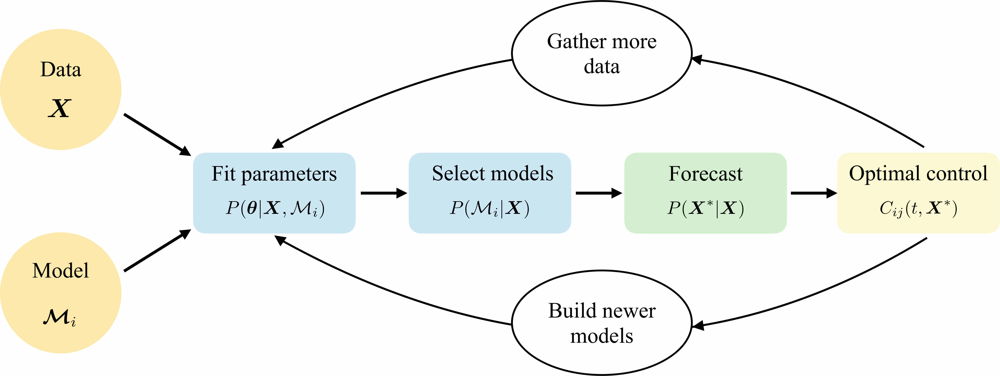

# PyRoss Documentation

## Worked out examples

* [**Example: Deterministic sampling in PyRoss**](https://github.com/rajeshrinet/pyross/blob/master/examples/deterministic/ex01-SIR.ipynb)
* [**Example: Stochastic sampling in PyRoss**](https://github.com/rajeshrinet/pyross/blob/master/examples/stochastic/ex1-SIR.ipynb)
* [**Example: Inference in PyRoss**](https://github.com/rajeshrinet/pyross/blob/master/examples/inference/ex01_inference_SIR.ipynb)

In addition please have a look at the [examples folder](https://github.com/rajeshrinet/pyross/tree/master/examples) for more Jupyter notebook examples.
The examples are structured along the following pipeline

The examples are classified as:

* [contactMatrix](https://github.com/rajeshrinet/pyross/tree/master/example/contactMatri): shows how to use contact matrix and intervention

* [control](https://github.com/rajeshrinet/pyross/tree/master/example/control): shows how to compute time dependent contact matrix which depend of time and state

* [deterministic](https://github.com/rajeshrinet/pyross/tree/master/example/deterministic): is for integration of equations of motion in the limit of no stochastic components

* [forecast](https://github.com/rajeshrinet/pyross/tree/master/example/forecast): is for forecasting once the parameters are known

* [hybrid](https://github.com/rajeshrinet/pyross/tree/master/example/hybrid): is for integration of equations of motion which can switch from deterministic to stochastic

* [inference](https://github.com/rajeshrinet/pyross/tree/master/example/Inference): shows how to infer parameters and select models given data

* [stochastic](https://github.com/rajeshrinet/pyross/tree/master/example/stochastic): is for integration of equations of motion with stochastic components

[Models.pdf](https://github.com/rajeshrinet/pyross/blob/master/docs/models.pdf) has a description of the various epidemiological models used in the examples (SIR, SIkR, SEIR, SEkIkR, SEAIR, SEAI5R, etc).
