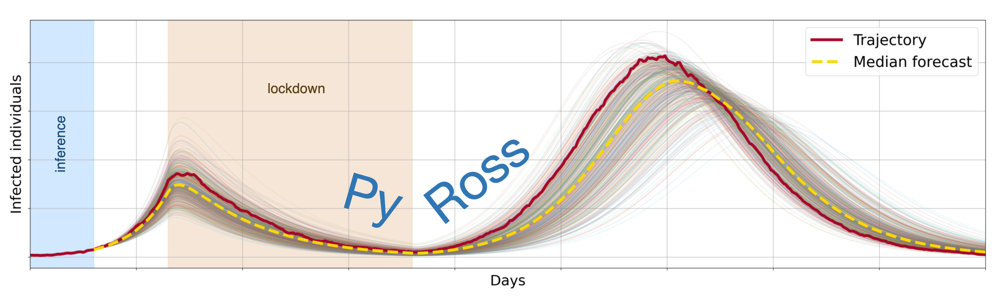

PyRoss API
==================================

PyRoss is a numerical library for inference, prediction and non-pharmaceutical interventions in age-structured epidemiological compartment models.

The library is designed to be model-agnostic and allows the user to define models in a JSON format. The most common epidemiological models, and several less common ones, come pre-defined with the library. Models can include stages to allow for non-exponentially distributed compartmental residence times. Currently, pre-defined models include ones with multiple infectious (symptomatic, asymptomatic etc) and non-infectious (exposed, asymptomatic etc) classes.

The library supports models formulated stochastically (as chemical master equations) or deterministically (as systems of differential equations). A hybrid algorithm transits dynamically between these depending on the magnitude of the compartmental fluctuations.

Inference on pre-defined or user-defined models is performed using model-adapted Gaussian processes on the epidemiological manifold or its tangent space. This method allows for latent variable inference and fast computation of the model evidence and the Fisher information matrix. These estimates are convolved with the instrinsic stochasticty of the dynamics to provide Bayesian forecasts of the progress of the epidemic.

Non-pharmaceutical interventions are implemented as modifications of the contact structures of the model. Optimised control of these structures, given cost functions, is possible. This feature is being actively developed to be better integrated with the library.

See installation instructions and more details in the `README.md <https://github.com/rajeshrinet/pyross/blob/master/README.md>`_ on GitHub.

Worked out examples
==========================

* `Example: Deterministic sampling in PyRoss <https://github.com/rajeshrinet/pyross/blob/master/examples/deterministic/ex01-SIR.ipynb>`_
* `Example: Stochastic sampling in PyRoss <https://github.com/rajeshrinet/pyross/blob/master/examples/stochastic/ex1-SIR.ipynb>`_
* `Example: Inference in PyRoss <https://github.com/rajeshrinet/pyross/blob/master/examples/inference/ex01_inference_SIR.ipynb>`_
* `Example: Inference with latent variables in PyRoss <https://github.com/rajeshrinet/pyross/blob/master/examples/inference/ex05_inference_latent_SIR.ipynb>`_
* `Example: Simulate any generic compartmental model in PyRoss <https://github.com/rajeshrinet/pyross/blob/master/examples/deterministic/ex16-Spp.ipynb>`_
* `Example: Inference with any generic compartment model in PyRoss <https://github.com/rajeshrinet/pyross/blob/master/examples/inference/ex_Spp.ipynb>`_

In addition please have a look at the `examples folder <https://github.com/rajeshrinet/pyross/tree/master/examples>`_ for more Jupyter notebook examples.

The examples are classified as:

* `contactMatrix <https://github.com/rajeshrinet/pyross/tree/master/examples/contactMatrix>`_ : shows how to use contact matrix and intervention
* `control <https://github.com/rajeshrinet/pyross/tree/master/examples/control>`_ : shows how to compute time dependent contact matrix which depend of time and state
* `deterministic <https://github.com/rajeshrinet/pyross/tree/master/examples/deterministic>`_ : is for integration of equations of motion in the limit of no stochastic components
* `forecast <https://github.com/rajeshrinet/pyross/tree/master/examples/forecast>`_ : is for forecasting once the parameters are known
* `hybrid <https://github.com/rajeshrinet/pyross/tree/master/examples/hybrid>`_ : is for integration of equations of motion which can switch from deterministic to stochastic
* `inference <https://github.com/rajeshrinet/pyross/tree/master/examples/inference>`_ : shows how to infer parameters and select models given data
* `stochastic <https://github.com/rajeshrinet/pyross/tree/master/examples/stochastic>`_ : is for integration of equations of motion with stochastic components

`Models.pdf <https://github.com/rajeshrinet/pyross/blob/master/docs/models.pdf>`_ has a description of the various epidemiological models used in the examples (SIR, SIkR, SEIR, SEAIR, Spp, etc).

API Reference
=============

.. toctree::
   :maxdepth: 1

   deterministic
   stochastic
   hybrid
   inference
   control
   contactMatrix
   forecast
   utils
